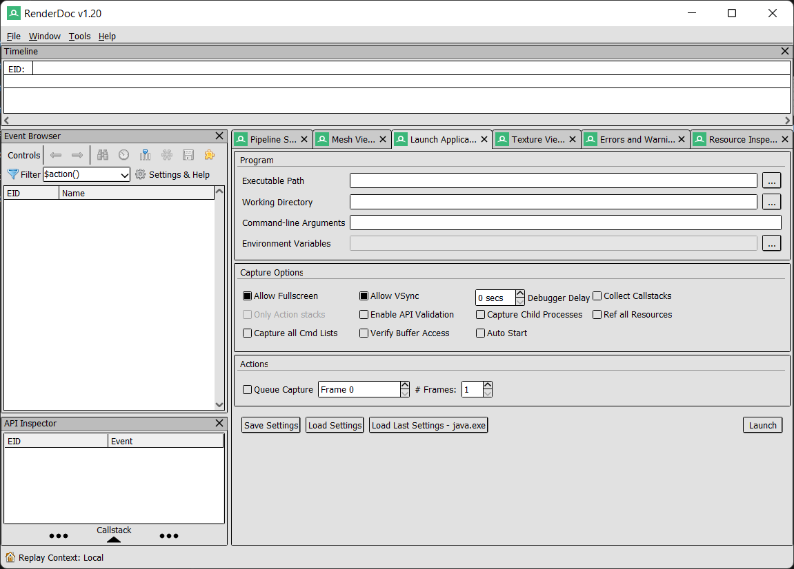
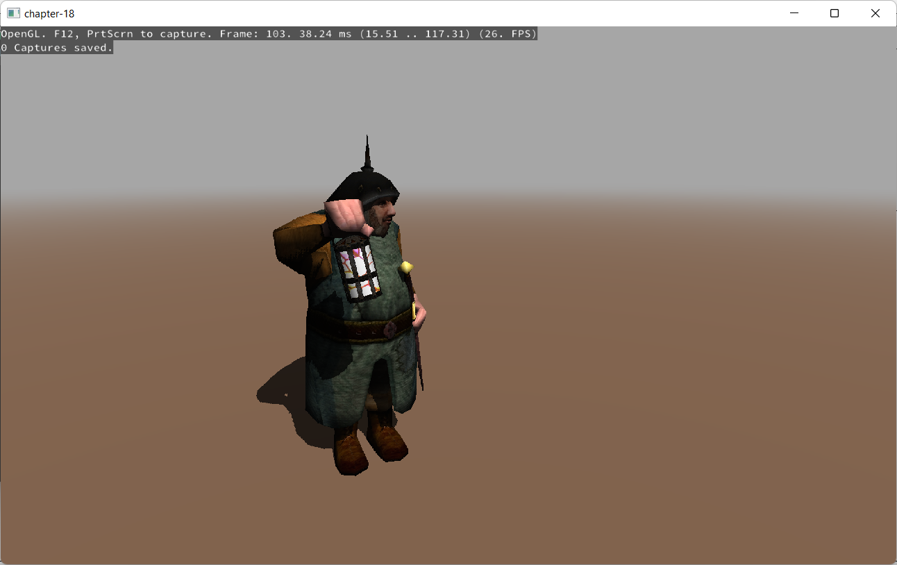
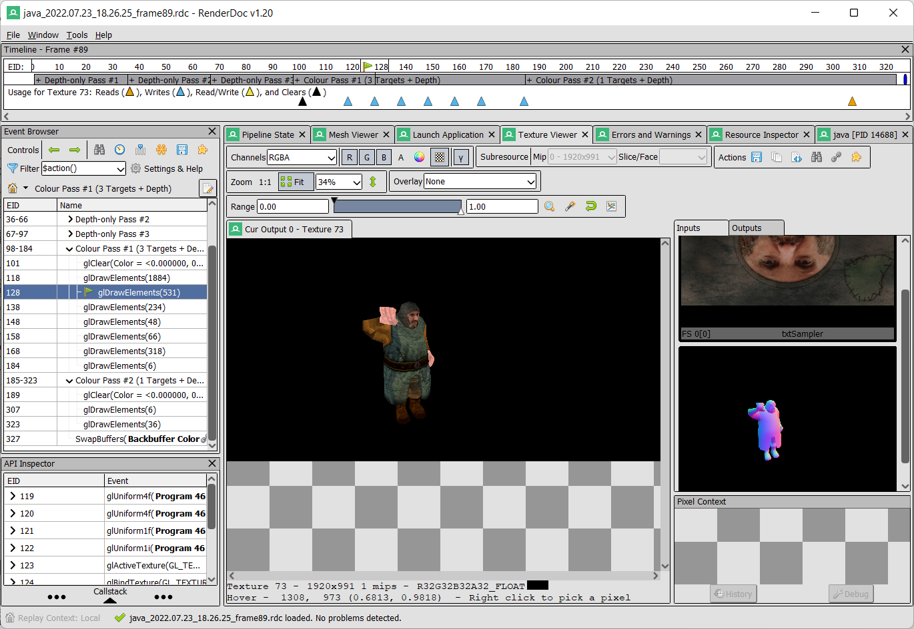
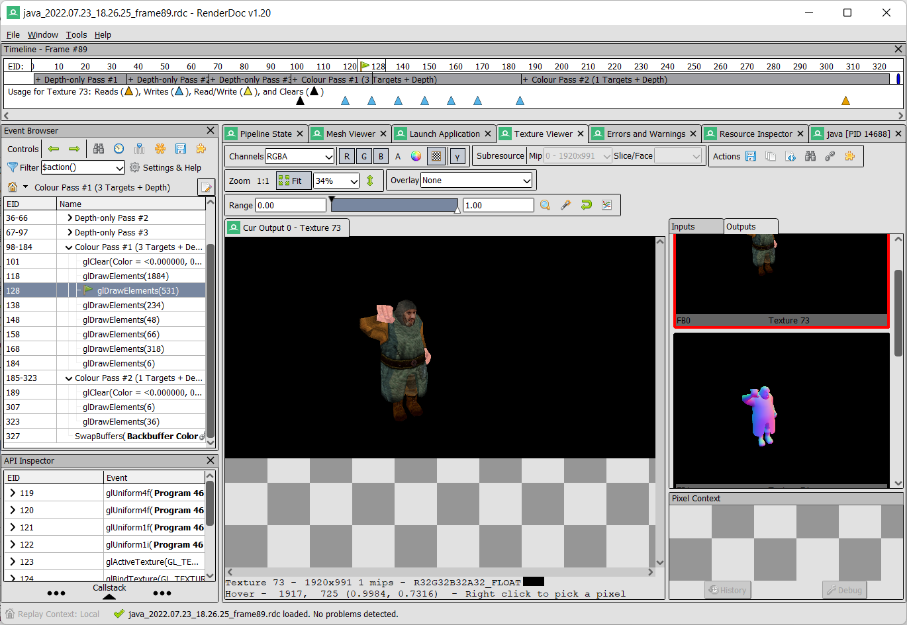
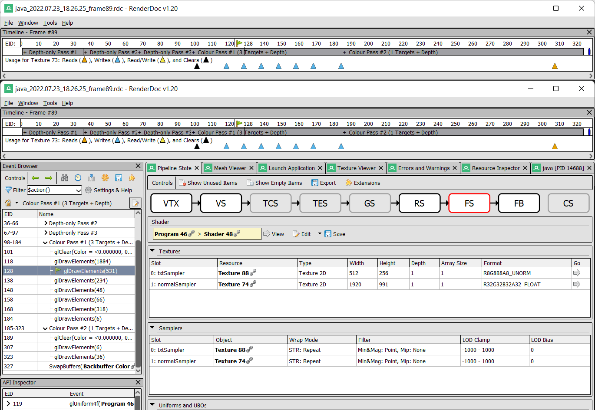

# Appendix A - OpenGL Debugging

Debugging an OpenGL program can be a daunting task. Most of the times you end up with a black screen and you have no means of knowing what’s going on. In order to alleviate this problem we can use some existing tools that will provide more information about the rendering process.

In this annex we will describe how to use the [RenderDoc](https://renderdoc.org/) tool to debug our LWJGL programs. RenderDoc is a graphics debugging tool that can be used with Direct3D, Vulkan and OpenGL. In the case of OpenGL it only supports the core profile from 3.2 up to 4.5.

So let’s get started. You need to download and install the RenderDoc version for your OS. Once installed, when you launch it you will see something similar to this.

The first step is to configure RenderDoc to execute and monitor our samples. In the “Capture Executable” tab we need to setup the following parameters:

* **Executable path**: In our case this should point to the JVM launcher (For instance, “C:\Program Files\Java\jdk-XX\bin\java.exe”).
* **Working Directory**: This is the working directory that will be setup for your program. In our case it should be set to the target directory where maven dumps the result. By setting this way, the dependencies will be able to be found (For instance, "D:/Projects/booksamples/chapter-18/target").
* **Command line arguments**: This will contain the arguments required by the JVM to execute our sample. In our case, just passing the jar to be executed (For instance, “-jar chapter-18-1.0.jar”).

There are many other options int this tab to configure the capture options. You can consult their purpose in [RenderDoc documentation](https://renderdoc.org/docs/index.html). Once everything has been setup you can execute your program by clicking on the “Launch” button. You will see something like this:

Once launched the process, you will see that a new tab has been added which is named “java \[PID XXXX]” (where the XXXX number represents the PID, the process identifier, of the java process).

From that tab you can capture the state of your program by pressing the “Trigger capture” button. Once a capture has been generated, you will see a little snapshot in that same tab.

If you double click on that capture, all the data collected will be loaded and you can start inspecting it. The “Event Browser” panel will be populated will all the relevant OpenGL calls executed during one rendering cycle.

You can see, the following events:

* Three depth passes for the cascade shadows.
* The geometry pass. If you click over a glDrawELements event, and select the “Mesh” tab you can see the mesh that was drawn, its input and output for the vertex shader.
* The lighting pass.

You can also view the input textures used for that drawing operation (by clicking the “Texture Viewer” tab).

In the center panel, you can see the output, and on the right panel you can see the list of textures used as an input. You can also view the output textures one by one. This is very illustrative to show how deferred shading works.

As you can see, this tool provides valuable information about what’s happening when rendering. It can save precious time while debugging rendering problems. It can even display information about the shaders used in the rendering pipeline.

