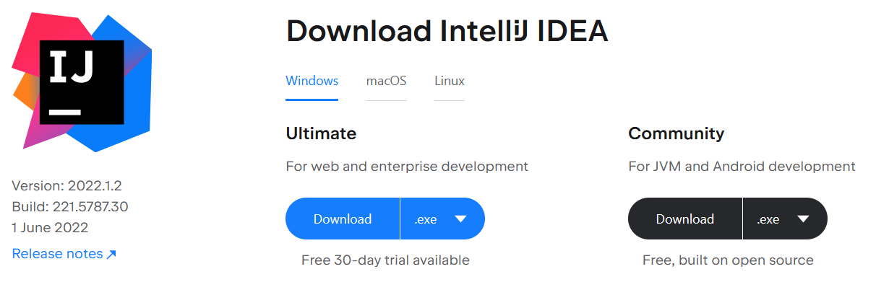

# Chapter 01 - First steps

In this book we will learn the principal techniques involved in developing 3D games using [OpenGL](https://www.opengl.org). We will develop our samples in Java and we will use the Lightweight Java Game Library [LWJGL](http://www.lwjgl.org/). LWJGL library enables the access to low-level APIs (Application Programming Interface) such as OpenGL from Java.

LWJGL is a low level API that acts like a wrapper around OpenGL. Therefore, if your idea is to start creating 3D games in a short period of time maybe you should consider other alternatives like [jMonkeyEngine](https://jmonkeyengine.org) or [Unity](https::/unity.com). By using this low level API you will have to go through many concepts and write lots of lines of code before you see the results. The benefit of doing it this way is that you will get a much better understanding of 3D graphics and you will always have the control.

Regarding Java, you will need at least Java 17. So the first step, in case you do not have that version installed, is to download the Java SDK. You can download the OpenJDK binaries [here](https://jdk.java.net/17/). In any case, this book assumes that you have a moderate understanding of the Java language. If this is not your case, you should first get proper knowledge of the language.

The best way to work with the examples is to clone the Github repository. You can either download the whole repository as a zip and extract in in your desired folder or clone it by using the following command: `git clone https://github.com/lwjglgamedev/lwjglbook.git`. In bot cases you will have a root folder which contains one sub folder per chapter.

You may use the Java IDE you want in order to run the samples. You can download IntelliJ IDEA which has good support for Java. IntelliJ provides a free open source version, the Community version, which you can download from here: [https://www.jetbrains.com/idea/download/](https://www.jetbrains.com/idea/download/ "IntelliJ").



When you open the source code in your IDE you can either open the root folder which contains all the chapters (the parent project) or each chapter independently. In the first case, please remember to properly set the working directory for each chapter to the root folder of the chapter. The samples will try to access files using relative paths assuming that the root folder is the chapter base folder.

For building our samples we will be using [Maven](https://maven.apache.org/). Maven is already integrated in most IDEs and you can directly open the different samples inside them. Just open the folder that contains the chapter sample and IntelliJ will detect that it is a maven project.


Maven builds projects based on an XML file named `pom.xml` \(Project Object Model\) which manages project dependencies \(the libraries you need to use\) and the steps to be performed during the build process. Maven follows the principle of convention over configuration, that is, if you stick to the standard project structure and naming conventions the configuration file does not need to explicitly say where source files are or where compiled classes should be located.

This book does not intend to be a maven tutorial, so please find the information about it in the web in case you need it. The source code root folder defines a parent project which defines the plugins to be used and collects the versions of the libraries employed. Therefore you will find there a `pom.xml` file which defines common actions and properties for all the chapters, which are handled as sub-projects.

LWJGL 3.1 introduced some changes in the way that the project is built. Now the base code is much more modular, and we can be more selective in the packages that we want to use instead of using a giant monolithic jar file. This comes at a cost: You now need to carefully specify the dependencies one by one. But the [download](https://www.lwjgl.org/download) page includes a fancy tool that generates the pom file for you. In our case, we will be first using GLFW and OpenGL bindings. You can check what the pom file looks like in the source code.

The LWJGL platform dependency already takes care of unpacking native libraries for your platform, so there's no need to use other plugins \(such as `mavennatives`\). We just need to set up three profiles to set a property that will configure the LWJGL platform. The profiles will set up the correct values of that property for Windows, Linux and Mac OS families.

```xml
    <profiles>
        <profile>
            <id>windows-profile</id>
            <activation>
                <os>
                    <family>Windows</family>
                </os>
            </activation>
            <properties>
                <native.target>natives-windows</native.target>
            </properties>                
        </profile>
        <profile>
            <id>linux-profile</id>
            <activation>
                <os>
                    <family>Linux</family>
                </os>
            </activation>
            <properties>
                <native.target>natives-linux</native.target>
            </properties>                
        </profile>
        <profile>
            <id>OSX-profile</id>
            <activation>
                <os>
                    <family>mac</family>
                </os>
            </activation>
            <properties>
                <native.target>natives-osx</native.target>
            </properties>
        </profile>
    </profiles>
```

Inside each project, the LWJGL platform dependency will use the correct property established in the profile for the current platform.

```xml
        <dependency>
            <groupId>org.lwjgl</groupId>
            <artifactId>lwjgl-platform</artifactId>
            <version>${lwjgl.version}</version>
            <classifier>${native.target}</classifier>
        </dependency>
```

Besides that, every project generates a runnable jar \(one that can be executed by typing java -jar name\_of\_the\_jar.jar\). This is achieved by using the maven-jar-plugin which creates a jar with a `MANIFEST.MF` file with the correct values. The most important attribute for that file is `Main-Class`, which sets the entry point for the program. In addition, all the dependencies are set as entries in the `Class-Path` attribute for that file. In order to execute it on another computer, you just need to copy the main jar file and the lib directory \(with all the jars included there\) which are located under the target directory.

The jars that contain LWJGL classes, also contain the native libraries. LWJGL will also take care of extracting them and adding them to the path where the JVM will look for libraries.

This chapter's source code is taken directly from the getting started sample in the LWJGL site [http://www.lwjgl.org/guide](http://www.lwjgl.org/guide). Although it is very well documented let's go through the source code and explain the most relevant parts. Since pasting the source code for each class will make it impossible to read, we will include fragments. In order for you to better understand the class to which each specific fragment belongs, we will always include the class header in each fragment. We will use three dots (`...`) to indicate that there is more code before / after the fragment. The sample is contained in a single class named `HelloWorld` which starts like this:
```java
package org.lwjglb;

import org.lwjgl.Version;
import org.lwjgl.glfw.*;
import org.lwjgl.opengl.GL;
import org.lwjgl.system.MemoryStack;

import java.nio.IntBuffer;

import static org.lwjgl.glfw.Callbacks.glfwFreeCallbacks;
import static org.lwjgl.glfw.GLFW.*;
import static org.lwjgl.opengl.GL11.*;
import static org.lwjgl.system.MemoryStack.stackPush;
import static org.lwjgl.system.MemoryUtil.NULL;

public class HelloWorld {

    // The window handle
    private long window;

    public static void main(String[] args) {
        new HelloWorld().run();
    }
    ...
}
```

The class just stores a reference to a Window handle (we will see what this means later on), an in the `main` method we just call the `run` method. Let's start dissecting that method:
```java
public class HelloWorld {
    ...
    public void run() {
        System.out.println("Hello LWJGL " + Version.getVersion() + "!");

        init();
        loop();

        // Free the window callbacks and destroy the window
        glfwFreeCallbacks(window);
        glfwDestroyWindow(window);

        // Terminate GLFW and free the error callback
        glfwTerminate();
        glfwSetErrorCallback(null).free();
    }
    ...
}
```
This method just calls the `init` method to initialize the application and then calls the `loop` method which is basically and endless loop which renders to a a window. When the `loop` method is finished we just need to free some resources created during initialization (the GLFW window). Let's start with the `init` method.

```java
public class HelloWorld {
    ...
    private void init() {
        // Setup an error callback. The default implementation
        // will print the error message in System.err.
        GLFWErrorCallback.createPrint(System.err).set();

        // Initialize GLFW. Most GLFW functions will not work before doing this.
        if (!glfwInit())
            throw new IllegalStateException("Unable to initialize GLFW");

        // Configure GLFW
        glfwDefaultWindowHints(); // optional, the current window hints are already the default
        glfwWindowHint(GLFW_VISIBLE, GLFW_FALSE); // the window will stay hidden after creation
        glfwWindowHint(GLFW_RESIZABLE, GLFW_TRUE); // the window will be resizable

        // Create the window
        window = glfwCreateWindow(300, 300, "Hello World!", NULL, NULL);
        if (window == NULL)
            throw new RuntimeException("Failed to create the GLFW window");

        // Setup a key callback. It will be called every time a key is pressed, repeated or released.
        glfwSetKeyCallback(window, (window, key, scancode, action, mods) -> {
            if (key == GLFW_KEY_ESCAPE && action == GLFW_RELEASE)
                glfwSetWindowShouldClose(window, true); // We will detect this in the rendering loop
        });
        ...
    }
    ...
}
``` 
We start by invoking [GLFW](https://www.glfw.org/), which is library to handle GUI components \(Windows, etc.\) and events \(key presses, mouse movements, etc.\) with an OpenGL context attached in a straightforward way. Currently, you cannot using Swing or AWT directly to render OpenGL. If you want to use AWT you can check [ lwjgl3-awt
](https://github.com/LWJGLX/lwjgl3-awt), but in this book we will stick with GLFW. We first start by initializing GLFW library and setting some parameters for window initialization (such as if it is resizable or not). The window is created by calling the `glfwCreateWindow` which receive window's width and height and the window title. This function returns a handle, which we need to store so we can use it ith any other GLFW related function. After that, we set a keyboard callback, that is a function that will be called when a key is pressed. In this case we just want to detect if the `ESC` key is pressed to close the window. Let's continue with the `init` method:
```java
public class HelloWorld {
    ...
    private void init() {
        ...
        // Get the thread stack and push a new frame
        try (MemoryStack stack = stackPush()) {
            IntBuffer pWidth = stack.mallocInt(1); // int*
            IntBuffer pHeight = stack.mallocInt(1); // int*

            // Get the window size passed to glfwCreateWindow
            glfwGetWindowSize(window, pWidth, pHeight);

            // Get the resolution of the primary monitor
            GLFWVidMode vidmode = glfwGetVideoMode(glfwGetPrimaryMonitor());

            // Center the window
            glfwSetWindowPos(
                    window,
                    (vidmode.width() - pWidth.get(0)) / 2,
                    (vidmode.height() - pHeight.get(0)) / 2
            );
        } // the stack frame is popped automatically

        // Make the OpenGL context current
        glfwMakeContextCurrent(window);
        // Enable v-sync
        glfwSwapInterval(1);

        // Make the window visible
        glfwShowWindow(window);
    }
    ...
}
```

Although we will explain it in next chapters, you will see here a key class in LWJGL which is the `MemoryStack`. As it has been said before, LJWGL provides wrappers around native libraries (C-based functions). Java does not have the concept of pointers (at least thinking in C terms), so passing structures to C functions is not a straight forward task. In order to share those structures, and to have pass by reference parameters, such as in the example above, we need to allocate memory which can be accessed by native code. LWJGL provides the `MemoryStack` class which allows us to allocate native-accessible memory / structures which is automatically cleaned (in fact is returned to a pool like structure so it can be reused) when we are out of the scope where `stackPush` method is called. Every native-accessible memory / structure is instantiated through this stack class. In the sample above we need to call the `glfwGetWindowSize` to get window dimensions. The values are returned using a pass-by-reference approach, so meed to allocate two ints (in the form of two `IntBuffer`'s). With that information and the dimensions of the monitor we can center the window, setup OpenGL, enable v-sync (more on this in next chapter) and finally show the window.

Now we need an endless loop to render continuously something:
```java
public class HelloWorld {
    ...
    private void loop() {
        // This line is critical for LWJGL's interoperation with GLFW's
        // OpenGL context, or any context that is managed externally.
        // LWJGL detects the context that is current in the current thread,
        // creates the GLCapabilities instance and makes the OpenGL
        // bindings available for use.
        GL.createCapabilities();

        // Set the clear color
        glClearColor(1.0f, 0.0f, 0.0f, 0.0f);

        // Run the rendering loop until the user has attempted to close
        // the window or has pressed the ESCAPE key.
        while (!glfwWindowShouldClose(window)) {
            glClear(GL_COLOR_BUFFER_BIT | GL_DEPTH_BUFFER_BIT); // clear the framebuffer

            glfwSwapBuffers(window); // swap the color buffers

            // Poll for window events. The key callback above will only be
            // invoked during this call.
            glfwPollEvents();
        }
    }
    ...
}
```
We first create OpenGL context, set up the clear color and perform a clear operation (over color abd depth buffers) in each loop, polling for keyboard events to detect if window should be closed. We will explain these concepts in detail along next chapters. However, just for the sake of completeness, render is done over a target, in this case over a buffer which contains color information and depth values (for 3D), after we have finished rendering over these buffers, we just need to inform GLFW that this buffer is ready for presenting by calling `glfwSwapBuffers`. GLFW will maintain several buffers so we can perform render operations over one buffer while the other one is presented in the window (if not, we would have flickering artifacts).

If you have your environment correctly set up you should be able to execute it and see a window with a red background.


The source code of this chapter is located [here](https://github.com/lwjglgamedev/lwjglbook/tree/main/chapter-01).

[Next chapter](../chapter-02/chapter-02.md)
