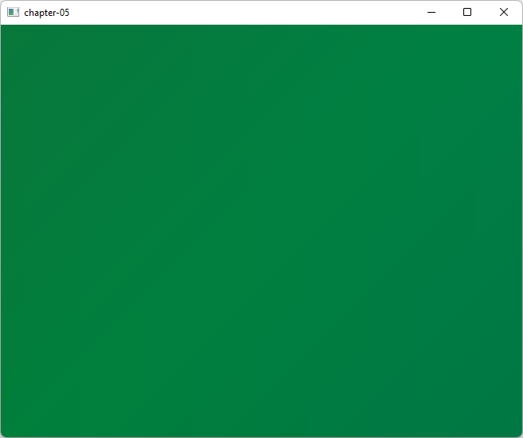

# Chapter 05 - Perspective projection

In this chapter, we will learn two important concepts, perspective projection (to render far away objects smaller than closer ones) and uniforms (a buffer like structure to pass additional data to the shader).

You can find the complete source code for this chapter [here](https://github.com/lwjglgamedev/lwjglbook/tree/main/chapter-05).

## Perspective projection

Let’s get back to our nice colored quad we created in the previous chapter. If you look carefully, you will see that the quad is distorted and appears as a rectangle. You can even change the width of the window from 600 pixels to 900 and the distortion will be more evident. What’s happening here?

If you revisit our vertex shader code we are just passing our coordinates directly. That is, when we say that a vertex has a value for coordinate x of 0.5 we are saying to OpenGL to draw it at x position 0.5 on our screen. The following figure shows the OpenGL coordinates (just for x and y axis).


Those coordinates are mapped, considering our window size, to window coordinates (which have the origin at the top-left corner of the previous figure). So, if our window has a size of 900x580, OpenGL coordinates (1,0) will be mapped to coordinates (900, 0) creating a rectangle instead of a quad.

.png>)

But, the problem is more serious than that. Modify the z coordinate of our quad from 0.0 to 1.0 and to -1.0. What do you see? The quad is exactly drawn in the same place no matter if it’s displaced along the z axis. Why is this happening? Objects that are further away should be drawn smaller than objects that are closer. But we are drawing them with the same x and y coordinates.

But, wait. Should this not be handled by the z coordinate? The answer is yes and no. The z coordinate tells OpenGL that an object is closer or farther away, but OpenGL does not know anything about the size of your object. You could have two objects of different sizes, one closer and smaller and one bigger and further that could be projected correctly onto the screen with the same size (those would have same x and y coordinates but different z). OpenGL just uses the coordinates we are passing, so we must take care of this. We need to correctly project our coordinates.

Now that we have diagnosed the problem, how do we fix it? The answer is using a perspective projection matrix. The perspective projection matrix will take care of the aspect ratio (the relation between size and height) of our drawing area so objects won’t be distorted. It also will handle the distance so objects far away from us will be drawn smaller. The projection matrix will also consider our field of view and the maximum distance to be displayed.

For those not familiar with matrices, a matrix is a bi-dimensional array of numbers arranged in columns and rows. Each number inside a matrix is called an element. A matrix order is the number of rows and columns. For instance, here you can see a 2x2 matrix (2 rows and 2 columns).

.png>)

Matrices have a number of basic operations that can be applied to them (such as addition, multiplication, etc.) that you can consult in a math book. The main characteristics of matrices, related to 3D graphics, is that they are very useful to transform points in the space.

You can think about the projection matrix as a camera, which has a field of view and a minimum and maximum distance. The vision area of that camera will be obtained from a truncated pyramid. The following picture shows a top view of that area.

.png>)

A projection matrix will correctly map 3D coordinates so they can be correctly represented on a 2D screen. The mathematical representation of that matrix is as follows (don’t be scared).

.png>)

Where aspect ratio is the relation between our screen width and our screen height ($$a=width/height$$). In order to obtain the projected coordinates of a given point we just need to multiply the projection matrix by the original coordinates. The result will be another vector that will contain the projected version.

So we need to handle a set of mathematical entities such as vectors, matrices and include the operations that can be done on them. We could choose to write all that code by our own from scratch or use an already existing library. We will choose the easy path and use a specific library for dealing with math operations in LWJGL which is called JOML (Java OpenGL Math Library). In order to use that library we just need to add another dependency to our `pom.xml` file.

```xml
        <dependency>
            <groupId>org.joml</groupId>
            <artifactId>joml</artifactId>
            <version>${joml.version}</version>
        </dependency>
```

Now that everything has been set up let’s define our projection matrix. We will create a new class named `Projection` which is defined like this:

```java
package org.lwjglb.engine.scene;

import org.joml.Matrix4f;

public class Projection {

    private static final float FOV = (float) Math.toRadians(60.0f);
    private static final float Z_FAR = 1000.f;
    private static final float Z_NEAR = 0.01f;

    private Matrix4f projMatrix;

    public Projection(int width, int height) {
        projMatrix = new Matrix4f();
        updateProjMatrix(width, height);
    }

    public Matrix4f getProjMatrix() {
        return projMatrix;
    }

    public void updateProjMatrix(int width, int height) {
        projMatrix.setPerspective(FOV, (float) width / height, Z_NEAR, Z_FAR);
    }
}
```

As you can see, it relies on the `Matrix4f` class (provided by the JOML library) which provides a method to set up a perspective projection matrix named `setPerspective`. This method needs the following parameters:

* Field of View: The Field of View angle in radians. We just use the `FOV` constant for that
* Aspect Ratio: That is, the relation ship between render width and height.
* Distance to the near plane (z-near)
* Distance to the far plane (z-far).

We will store a `Projection` class instance in the `Scene` class and initialize it in the constructor. IN addition to that, we weill need to take care if the window is resized, so we provide a new method in that `Scene` class, named `resize` to recalculate the perspective projection matrix when window dimensions change.

```java
public class Scene {
    ...
    private Projection projection;

    public Scene(int width, int height) {
        ...
        projection = new Projection(width, height);
    }
    ...
    public Projection getProjection() {
        return projection;
    }

    public void resize(int width, int height) {
        projection.updateProjMatrix(width, height);
    }    
}
```

We need also to update the `Engine` to adapt it to the new `Scene` class constructor parameters and to invoke the `resize` method:

```java
public class Engine {
    ...
    public Engine(String windowTitle, Window.WindowOptions opts, IAppLogic appLogic) {
        ...
        scene = new Scene(window.getWidth(), window.getHeight());
        ...
    }
    ...
    private void resize() {
        scene.resize(window.getWidth(), window.getHeight());
    }
    ...
}
```

## Uniforms

Now that we have the infrastructure to calculate the perspective projection matrix, how do we use it? We need to use it in our shader, and it should be applied to all the vertices. At first, you could think of bundling it in the vertex input (like the coordinates and the colors). In this case we would be wasting lots of space since the projection matrix is common to any vertex. You may also think of multiplying the vertices by the matrix in the java code. But then, our VBOs would be useless and we will not be using the process power available in the graphics card.

The answer is to use “uniforms”. Uniforms are global GLSL variables that shaders can use and that we will employ to pass data that is common to all elements or to a model. So, let's start with how uniforms are used in shader programs. We need to modify our vertex shader code and declare a new uniform called `projectionMatrix` and use it to calculate the projected position.

```glsl
#version 330

layout (location=0) in vec3 position;
layout (location=1) in vec3 color;

out vec3 outColor;

uniform mat4 projectionMatrix;

void main()
{
    gl_Position = projectionMatrix * vec4(position, 1.0);
    outColor = color;
}
```

As you can see we define our `projectionMatrix` as a 4x4 matrix and the position is obtained by multiplying it by our original coordinates. Now we need to pass the values of the projection matrix to our shader. We will create a new class named `UniformMap` which will allow us to create references to the uniforms and set up their values. It starts like this:

```java
package org.lwjglb.engine.graph;

import org.joml.Matrix4f;
import org.lwjgl.system.MemoryStack;

import java.util.*;

import static org.lwjgl.opengl.GL20.*;

public class UniformsMap {

    private int programId;
    private Map<String, Integer> uniforms;

    public UniformsMap(int programId) {
        this.programId = programId;
        uniforms = new HashMap<>();
    }

    public void createUniform(String uniformName) {
        int uniformLocation = glGetUniformLocation(programId, uniformName);
        if (uniformLocation < 0) {
            throw new RuntimeException("Could not find uniform [" + uniformName + "] in shader program [" +
                    programId + "]");
        }
        uniforms.put(uniformName, uniformLocation);
    }
    ...
}
```

As you can see, the constructor receives the identifier of the shader program and it defines a `Map` to store the references (`Integer` instances) to uniforms which are created in the `createUniform` method. Uniforms references are retrieved by calling the `glGetUniformLocation` function, which receives two parameters:

* The shader program identifier.
* The name of the uniform (it should match the one defined in the shader code).

As you can see, uniform creation is independent on the data type associated to it. We will need to have separate methods for the different types when we want to set the data for that uniform. By now, we will just need a method to load a 4x4 matrix:

```java
public class UniformsMap {
    ...
    public void setUniform(String uniformName, Matrix4f value) {
        try (MemoryStack stack = MemoryStack.stackPush()) {
            Integer location = uniforms.get(uniformName);
            if (location == null) {
                throw new RuntimeException("Could not find uniform [" + uniformName + "]");
            }
            glUniformMatrix4fv(location.intValue(), false, value.get(stack.mallocFloat(16)));
        }
    }
}
```

Now, we can use the code above in the `SceneRender` class:

```java
public class SceneRender {
    ...
    private UniformsMap uniformsMap;

    public SceneRender() {
        ...
        createUniforms();
    }
    ...
    private void createUniforms() {
        uniformsMap = new UniformsMap(shaderProgram.getProgramId());
        uniformsMap.createUniform("projectionMatrix");
    }
    ...
    public void render(Scene scene) {
        ...
        uniformsMap.setUniform("projectionMatrix", scene.getProjection().getProjMatrix());
        ...
    }
}
```

We are almost done. We can now show the quad correctly rendered, So you can now launch your program and will obtain a... black background without any coloured quad. What’s happening? Did we break something? Well, actually no. Remember that we are now simulating the effect of a camera looking at our scene. And we provided two distances, one to the farthest plane (equal to 1000f) and one to the closest plane (equal to 0.01f). Our coordinates were:

```java
float[] positions = new float[]{
    -0.5f,  0.5f, 0.0f,
    -0.5f, -0.5f, 0.0f,
     0.5f, -0.5f, 0.0f,
     0.5f,  0.5f, 0.0f,
};
```

That is, our z coordinates are outside the visible zone. Let’s assign them a value of `-0.05f`. Now you will see a giant square like this:



What is happening now is that we are drawing the quad too close to our camera. We are actually zooming into it. If we assign now a value of `-1.0f` to the z coordinate we can now see our coloured quad.

```java
public class Main implements IAppLogic {
    ...
    public static void main(String[] args) {
        ...
        Engine gameEng = new Engine("chapter-05", new Window.WindowOptions(), main);
        ...
    }
    ...
    public void init(Window window, Scene scene, Render render) {
        float[] positions = new float[]{
                -0.5f, 0.5f, -1.0f,
                -0.5f, -0.5f, -1.0f,
                0.5f, -0.5f, -1.0f,
                0.5f, 0.5f, -1.0f,
        };
        ...
    }
    ...
}
```


If we continue pushing the quad backwards we will see it becoming smaller. Notice also that our quad does not appear as a rectangle anymore.

[Next chapter](../chapter-06/chapter-06.md)
