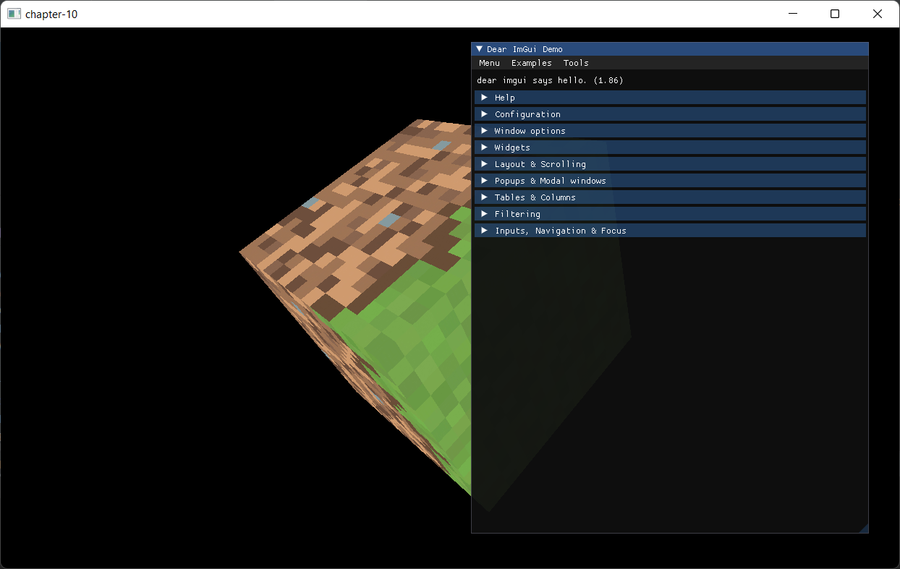

# Chapter 10 - GUI drawing with Imgui

[Dear ImGui}(https://github.com/ocornut/imgui) is a user interface library which can use several backends such as OpenGL and Vulkan. We will use it to display gui controls or to develop HUDs. It provides multiple widgets and the look and fell is easily customizable.

You can find the complete source code for this chapter [here](https://github.com/lwjglgamedev/lwjglbook/chapter-10).

## Imgui integration

The first thing is adding Java Imgui wrapper maven dependencies to the project pom.xml. We need to add compile time and runtime dependencies.

```xml
<dependency>
   <groupId>io.github.spair</groupId>
   <artifactId>imgui-java-binding</artifactId>
   <version>${imgui-java.version}</version>
</dependency>
<dependency>
    <groupId>io.github.spair</groupId>
    <artifactId>imgui-java-${native.target}</artifactId>
    <version>${imgui-java.version}</version>
    <scope>runtime</scope>
</dependency>
```

With Imgui we can render windows, panels, etc. like we render any other 3D model, but using only 2D shapes. We set the controls that we want to use and Imgui translates that to a set of vertex buffers that we can render using shaders. This is why it can be used with any backend.

For each vertex, Imgui defines its coordinates (2D coordinates), texture coordinates and the associated color. Therefore, we need to create a new class to model Gui meshes and to create the associated VAO and VBO. The class, named `GuiMesh` is defined like this.

```java
package org.lwjglb.engine.graph;

import imgui.ImDrawData;

import static org.lwjgl.opengl.GL15.*;
import static org.lwjgl.opengl.GL20.*;
import static org.lwjgl.opengl.GL30.*;

public class GuiMesh {

    private int indicesVBO;
    private int vaoId;
    private int verticesVBO;

    public GuiMesh() {
        vaoId = glGenVertexArrays();
        glBindVertexArray(vaoId);

        // Single VBO
        verticesVBO = glGenBuffers();
        glBindBuffer(GL_ARRAY_BUFFER, verticesVBO);
        glEnableVertexAttribArray(0);
        glVertexAttribPointer(0, 2, GL_FLOAT, false, ImDrawData.SIZEOF_IM_DRAW_VERT, 0);
        glEnableVertexAttribArray(1);
        glVertexAttribPointer(1, 2, GL_FLOAT, false, ImDrawData.SIZEOF_IM_DRAW_VERT, 8);
        glEnableVertexAttribArray(2);
        glVertexAttribPointer(2, 4, GL_UNSIGNED_BYTE, true, ImDrawData.SIZEOF_IM_DRAW_VERT, 16);

        indicesVBO = glGenBuffers();

        glBindBuffer(GL_ARRAY_BUFFER, 0);
        glBindVertexArray(0);
    }

    public void cleanup() {
        glDeleteBuffers(indicesVBO);
        glDeleteBuffers(verticesVBO);
        glDeleteVertexArrays(vaoId);
    }

    public int getIndicesVBO() {
        return indicesVBO;
    }

    public int getVaoId() {
        return vaoId;
    }

    public int getVerticesVBO() {
        return verticesVBO;
    }
}
```

As you can see, we use a single VBO but we define several attributes for the positions, texture coordinates and color. In this case, we do not populate the buffers with data, we will see later on how we will use it.

We need also to let the application create GUI controls and react to the user input. In order to support this, we will define a new interface named `IGuiInstance` which is defined like this:

```java
package org.lwjglb.engine;

import org.lwjglb.engine.scene.Scene;

public interface IGuiInstance {
    void drawGui();

    boolean handleGuiInput(Scene scene, Window window);
}
```

The method `drawGui` will be used to construct the GUI, this where we will define the window and widgets that will be used to construct the GUI meshes. We will use the `handleGuiInput` method to process input events in the GUI. It returns a boolean value to state that the input has been processed by the GUI or not. For example, if we display an overlapping window we may not be interested in keep processing keystrokes in the game logic. You can use the return value to control that. We will store the specific implementation of `IGuiInstance` interface in the `Scene` class.

```java
public class Scene {
    ...
    private IGuiInstance guiInstance;
    ...
    public IGuiInstance getGuiInstance() {
        return guiInstance;
    }
    ...
    public void setGuiInstance(IGuiInstance guiInstance) {
        this.guiInstance = guiInstance;
    }
}
```

The next step will be to create a new class to render our GUI, which will be named `GuiRender` and starts like this:
```java
package org.lwjglb.engine.graph;

import imgui.*;
import imgui.type.ImInt;
import org.joml.Vector2f;
import org.lwjglb.engine.*;
import org.lwjglb.engine.scene.Scene;

import java.nio.ByteBuffer;
import java.util.*;

import static org.lwjgl.opengl.GL32.*;

public class GuiRender {

    private GuiMesh guiMesh;
    private Vector2f scale;
    private ShaderProgram shaderProgram;
    private Texture texture;
    private UniformsMap uniformsMap;

    public GuiRender(Window window) {
        List<ShaderProgram.ShaderModuleData> shaderModuleDataList = new ArrayList<>();
        shaderModuleDataList.add(new ShaderProgram.ShaderModuleData("resources/shaders/gui.vert", GL_VERTEX_SHADER));
        shaderModuleDataList.add(new ShaderProgram.ShaderModuleData("resources/shaders/gui.frag", GL_FRAGMENT_SHADER));
        shaderProgram = new ShaderProgram(shaderModuleDataList);
        createUniforms();
        createUIResources(window);
    }

    public void cleanup() {
        shaderProgram.cleanup();
        texture.cleanup();
    }
    ...
}
```

As you can see, most of the stuff here will be very familiar to you, we just set up the shaders and the uniforms. However, there is a new method called `createUIResources` which is defined like this:

```java
public class GuiRender {
    ...
    private void createUIResources(Window window) {
        ImGui.createContext();

        ImGuiIO imGuiIO = ImGui.getIO();
        imGuiIO.setIniFilename(null);
        imGuiIO.setDisplaySize(window.getWidth(), window.getHeight());

        ImFontAtlas fontAtlas = ImGui.getIO().getFonts();
        ImInt width = new ImInt();
        ImInt height = new ImInt();
        ByteBuffer buf = fontAtlas.getTexDataAsRGBA32(width, height);
        texture = new Texture(width.get(), height.get(), buf);

        guiMesh = new GuiMesh();
    }
    ...
}
```

In the method above is where we setup Imgui, we first create a context (required to perform any operation), and set up the display size to the window size. Imgui stores the status in an ini file, since we do not want the status to persist between runs we need to set it yo null. The next step is to initialize the font atlas and set up a texture which will be used in the shaders so we can render properly texts, etc. The final step is to create the `GuiMesh` instance.

The `createUniforms` just creates a single two float for the scale (we will see later on how it will be used).

```java
public class GuiRender {
    ...
    private void createUniforms() {
        uniformsMap = new UniformsMap(shaderProgram.getProgramId());
        uniformsMap.createUniform("scale");
        scale = new Vector2f();
    }
    ...
}
```

Let's view the `render` method now:

```java
public class GuiRender {
    ...
    public void render(Scene scene) {
        IGuiInstance guiInstance = scene.getGuiInstance();
        if (guiInstance == null) {
            return;
        }
        guiInstance.drawGui();

        shaderProgram.bind();

        glEnable(GL_BLEND);
        glBlendEquation(GL_FUNC_ADD);
        glBlendFuncSeparate(GL_SRC_ALPHA, GL_ONE_MINUS_SRC_ALPHA, GL_ONE, GL_ONE_MINUS_SRC_ALPHA);
        glDisable(GL_DEPTH_TEST);
        glDisable(GL_CULL_FACE);

        glBindVertexArray(guiMesh.getVaoId());

        glBindBuffer(GL_ARRAY_BUFFER, guiMesh.getVerticesVBO());
        glBindBuffer(GL_ELEMENT_ARRAY_BUFFER, guiMesh.getIndicesVBO());

        ImGuiIO io = ImGui.getIO();
        scale.x = 2.0f / io.getDisplaySizeX();
        scale.y = -2.0f / io.getDisplaySizeY();
        uniformsMap.setUniform("scale", scale);

        ImDrawData drawData = ImGui.getDrawData();
        int numLists = drawData.getCmdListsCount();
        for (int i = 0; i < numLists; i++) {
            glBufferData(GL_ARRAY_BUFFER, drawData.getCmdListVtxBufferData(i), GL_STREAM_DRAW);
            glBufferData(GL_ELEMENT_ARRAY_BUFFER, drawData.getCmdListIdxBufferData(i), GL_STREAM_DRAW);

            int numCmds = drawData.getCmdListCmdBufferSize(i);
            for (int j = 0; j < numCmds; j++) {
                final int elemCount = drawData.getCmdListCmdBufferElemCount(i, j);
                final int idxBufferOffset = drawData.getCmdListCmdBufferIdxOffset(i, j);
                final int indices = idxBufferOffset * ImDrawData.SIZEOF_IM_DRAW_IDX;

                texture.bind();
                glDrawElements(GL_TRIANGLES, elemCount, GL_UNSIGNED_SHORT, indices);
            }
        }

        glEnable(GL_DEPTH_TEST);
        glEnable(GL_CULL_FACE);
        glDisable(GL_BLEND);
    }
    ...
}
```

The first thing that we do is to check if we have set up an implementation of the `IGuiInstance` interface. If there is no instance, we just return, there is no need to render anything. After that we call the `drawGui` method. That is, in each render call we invoke that method so the Imgui can update its status to be able to generate the proper vertex data. After binding the shader we first enable blending which will allow us to use transparencies. Just by enabling blending, transparencies still will not show up. We need also to instruct OpenGL about how the blending will be applied. This is done through the `glBlendFunc` function. You can check an excellent explanation about the details of the different functions that can be applied [here]( https://learnopengl.com/Advanced-OpenGL/Blending).

After that, we need to disable depth testing and face culling for Imgui to work properly. Then, we bind the gui mesh which defines the structure of the data and bind the data and indices buffers. Imgui uses screen coordinates to generate the vertices data, that is `x` values cover the `[0, screen width]` range and `y` values cover the `[0, screen height]`. We will use the `scale` uniform to map from that coordinate system to the `[-1, 1]` range of OpenGL's clip space.

After that, we retrieve the data generated by Imgui to render the GUI. IMgui first organizes the data in what they call command lists. Each command list has a buffer where it stores the vertex and indices data, so we first dump data to the GPU by calling the `glBufferData`. Each command list defines also a s set of commands which we will use to generate the draw calls. Each command stores the number of elements to be drawn and the offset to be applied to the buffer in the command list. When we have drawn all the elements we can re-enable the depth test.

Finally, we need to add a `resize` method which will be called any time the window is resized to adjust Imgui display size.

```java
public class GuiRender {
    ...
    public void resize(int width, int height) {
        ImGuiIO imGuiIO = ImGui.getIO();
        imGuiIO.setDisplaySize(width, height);
    }
}
```

We need to update the `UniformsMap` class to add support for 2D vectors:

```java
public class UniformsMap {
    ...
    public void setUniform(String uniformName, Vector2f value) {
        glUniform2f(getUniformLocation(uniformName), value.x, value.y);
    }
}
```

The vertex shader used for rendering the GUI is quite simple (`gui.vert`), we just transform the coordinates so they are in the `[-1, 1]` range and output the texture coordinates and color so they can be used in the fragment shader:

```glsl
#version 330

layout (location=0) in vec2 inPos;
layout (location=1) in vec2 inTextCoords;
layout (location=2) in vec4 inColor;

out vec2 frgTextCoords;
out vec4 frgColor;

uniform vec2 scale;

void main()
{
    frgTextCoords = inTextCoords;
    frgColor = inColor;
    gl_Position = vec4(inPos * scale + vec2(-1.0, 1.0), 0.0, 1.0);
}
```

In the fragment shader (`gui.frag`) we just output the combination of the vertex color and the texture color associated to its texture coordinates:

```glsl
#version 330

in vec2 frgTextCoords;
in vec4 frgColor;

uniform sampler2D txtSampler;

out vec4 outColor;

void main()
{
    outColor = frgColor  * texture(txtSampler, frgTextCoords);
}
```
## Putting it up all together

Now we need to glue all the previous pices to render the GUI. We will first start by using the new `GuiRender` class into the `Render` one.

```java
public class Render {
    ...
    private GuiRender guiRender;
    ...
    public Render(Window window) {
        ...
        guiRender = new GuiRender(window);
    }

    public void cleanup() {
        ...
        guiRender.cleanup();
    }

    public void render(Window window, Scene scene) {
        ...
        guiRender.render(scene);
    }

    public void resize(int width, int height) {
        guiRender.resize(width, height);
    }
}
```

We also need to modify the `Engine` class to include `IGuiInstance` in the update loop and to use its return value to indicate if input has been consumed or not.

```java
public class Engine {
    ...
    public Engine(String windowTitle, Window.WindowOptions opts, IAppLogic appLogic) {
        ...
        render = new Render(window);
        ...
    }
    ...
    private void resize() {
        int width = window.getWidth();
        int height = window.getHeight();
        scene.resize(width, height);
        render.resize(width, height);
    }

    private void run() {
        ...
        IGuiInstance iGuiInstance = scene.getGuiInstance();
        while (running && !window.windowShouldClose()) {
            ...
            if (targetFps <= 0 || deltaFps >= 1) {
                boolean inputConsumed = iGuiInstance != null ? iGuiInstance.handleGuiInput(scene, window) : false;
                appLogic.input(window, scene, now - initialTime, inputConsumed);
            }
            ...
        }
        ...
    }
    ...
}
```

We need also to update the `IAppLogic` interface to use the input consumed return value.

```java
public interface IAppLogic {
    ...
    void update(Window window, Scene scene, long diffTimeMillis);
    ...
}
```

Am finally, we will implement the `IGuiInstance in the `Main` class:

```java
public class Main implements IAppLogic, IGuiInstance {
    ...
    public static void main(String[] args) {
        ...
        Engine gameEng = new Engine("chapter-10", new Window.WindowOptions(), main);
        ...
    }

    ...
    @Override
    public void drawGui() {
        ImGui.newFrame();
        ImGui.setNextWindowPos(0, 0, ImGuiCond.Always);
        ImGui.showDemoWindow();
        ImGui.endFrame();
        ImGui.render();
    }

    @Override
    public boolean handleGuiInput(Scene scene, Window window) {
        ImGuiIO imGuiIO = ImGui.getIO();
        MouseInput mouseInput = window.getMouseInput();
        Vector2f mousePos = mouseInput.getCurrentPos();
        imGuiIO.setMousePos(mousePos.x, mousePos.y);
        imGuiIO.setMouseDown(0, mouseInput.isLeftButtonPressed());
        imGuiIO.setMouseDown(1, mouseInput.isRightButtonPressed());

        return imGuiIO.getWantCaptureMouse() || imGuiIO.getWantCaptureKeyboard();
    }
    ...
    public void input(Window window, Scene scene, long diffTimeMillis, boolean inputConsumed) {
        ...
    }
}
```

In the `drawGui` method we just setup a new frame, the window position and just invoke the `showDemoWindow` to generate Imgui's demo window. After ending the frame it is very important to call the `render` this is what will generate the set of commands upon the GUI structure defined previously. The `handleGuiInput` first gets mouse position and updates IMgui's IO class with that information and mouse button status. We also return a boolean that indicates that input has been capture by Imgui. Finally, we just need to update the `input`method to receive that flag (we are not doing anything with it yet, but it is in the interface we are implementing).

With all those changes you will be able to see Imgui demo window overlapping the rotating cube. You can interact with the different methods an panels to get a glimpse of the capabilities of Imgui.



[Next chapter](../chapter-11/chapter-11.md)