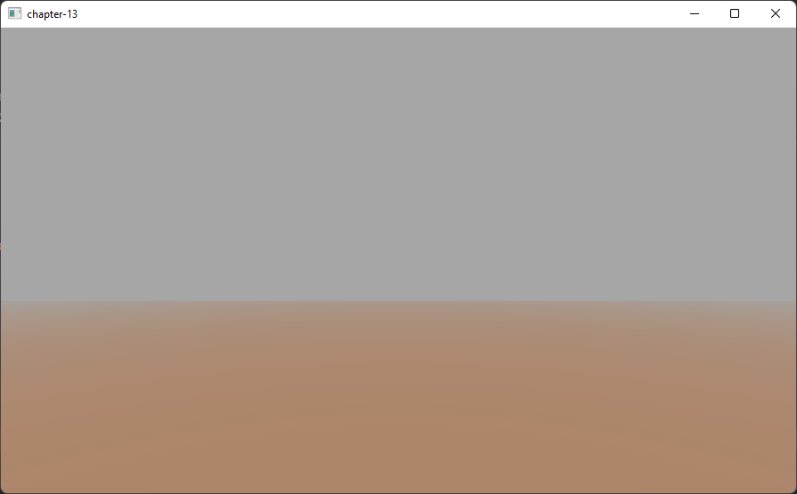

# Chapter 13 - Fog

In this chapter we will see review how to create a fog effect in our game engine. With that effect, we will simulate how distant objects get dimmed and seem to vanish into a dense fog.

You can find the complete source code for this chapter [here](https://github.com/lwjglgamedev/lwjglbook/tree/main/chapter-13).

## Concepts

Let us first examine the attributes that define fog. The first one is the fog color. In the real world, the fog has a gray color, but we can use this effect to simulate wide areas invaded by a fog with different colors. The attribute is the fog's density.

Thus, in order to apply the fog effect, we need to find a way to fade our 3D scene objects into the fog color as long as they get far away from the camera. Objects that are close to the camera will not be affected by the fog, but objects that are far away will not be distinguishable. So we need to be able to calculate a factor that can be used to blend the fog color and each fragment color in order to simulate that effect. That factor will need to be dependent on the distance to the camera.

Let’s call that factor $$fogFactor$$, and set its range from 0 to 1. When the $$fogFactor$$ is 1, it means that the object will not be affected by fog, that is, it’s a nearby object. When the $$fogFactor$$ takes the 0 value, it means that the objects will be completely hidden in the fog.

Therefore, the equation needed to calculate the fog color is:

$$finalColor = (1 - fogFactor) \cdot fogColor + fogFactor \cdot framentColor$$

* $$finalColor$$ is the color that results from applying the fog effect.
* $$fogFactor$$ is the parameters that controls how the fog color and the fragment color are blended. It basically controls the object visibility.
* $$fogColor$$ is the color of the fog.
* $$fragmentColor$$ is the color of the fragment without applying any fog effect on it.

Now we need to find a way to calculate $$fogFactor$$ depending on the distance. We can choose different models, and the first one could be to use a linear model. This is a model that, given a distance, changes the fogFactor value in a linear way.

The linear model can be defined by the following parameters:

* $$fogStart$$: The distance at where fog effects starts to be applied.
* $$fogFinish$$: The distance at where fog effects reach its maximum value.
* $$distance$$: Distance to the camera.

With those parameters, the equation to be applied is:

$$\displaystyle fogFactor = \frac{(fogFinish - distance)}{(fogFinish - fogStart)}$$

For objects at distance lower than $$fogStart$$ we just simply set the $$fogFactor$$ to $$1$$. The following graph shows how the $$fogFactor$$ changes with the distance.


The linear model is easy to calculate but it is not very realistic and it does not take into consideration the fog density. In reality, fog tends to grow in a smoother way. So the next suitable model is an exponential one. The equation for that model is as follows:

$$\displaystyle fogFactor = e^{-(distance \cdot fogDensity)^{exponent}} = \frac{1}{e^{(distance \cdot fogDensity)^{exponent}}}$$

The new variables that come into play are:

* $$fogDensity$$ which models the thickness or density of the fog.
* $$exponent$$ which is used to control how fast the fog increases with distance.

The following picture shows two graphs for the equation above for different values of the exponent \($$2$$ for the blue line and $$4$$ for the red one\).


In our code, we will use a formula that sets a value of two for the exponent \(you can easily modify the example to use different values\).

## Implementation

Now that the theory has been explained we can put it into practice. We will implement the effect in the scene fragment shader (`scene.frag`) since we have there all the variables we need. We will start by defining a struct that models the fog attributes.

```glsl
...
struct Fog
{
    int activeFog;
    vec3 color;
    float density;
};
...
```

The `active` attribute will be used to activate or deactivate the fog effect. The fog will be passed to the shader through another uniform named `fog`.

```glsl
...
uniform Fog fog;
...
```

 We will create a function named `calcFog` which is defined as this.

```glsl
...
vec4 calcFog(vec3 pos, vec4 color, Fog fog, vec3 ambientLight, DirLight dirLight) {
    vec3 fogColor = fog.color * (ambientLight + dirLight.color * dirLight.intensity);
    float distance = length(pos);
    float fogFactor = 1.0 / exp((distance * fog.density) * (distance * fog.density));
    fogFactor = clamp(fogFactor, 0.0, 1.0);

    vec3 resultColor = mix(fogColor, color.xyz, fogFactor);
    return vec4(resultColor.xyz, color.w);
}
...
```

As you can see, we first calculate the distance to the vertex. The vertex coordinates are defined in the `pos` variable and we just need to calculate the length. Then we calculate the fog factor using the exponential model with an exponent of two \(which is equivalent to multiply it twice\). We clamp the `fogFactor` to a range between $$0$$ and $$1$$ and use the `mix` function. In GLSL, the `mix` function is used to blend the fog color and the fragment color \(defined by variable `color`\). It's equivalent to applying this equation:

$$resultColor = (1 - fogFactor) \cdot fog.color + fogFactor \cdot color$$

We also preserve the w component, the transparency, of the original color. We don't want this component to be affected, as the fragment should maintain its transparency level.

At the end of the fragment shader, after applying all the light effects, we just simply assign the returned value to the fragment color if the fog is active.

```glsl
...
    if (fog.activeFog == 1) {
        fragColor = calcFog(outPosition, fragColor, fog, ambientLight.color, dirLight);
    }
...
```

We will create also a new class named `Fog` which is another POJO \(Plain Old Java Object\) that contains the fog attributes.

```java
package org.lwjglb.engine.scene;

import org.joml.Vector3f;

public class Fog {

    private boolean active;
    private Vector3f color;
    private float density;

    public Fog() {
        active = false;
        color = new Vector3f();
    }

    public Fog(boolean active, Vector3f color, float density) {
        this.color = color;
        this.density = density;
        this.active = active;
    }

    public Vector3f getColor() {
        return color;
    }

    public float getDensity() {
        return density;
    }

    public boolean isActive() {
        return active;
    }

    public void setActive(boolean active) {
        this.active = active;
    }

    public void setColor(Vector3f color) {
        this.color = color;
    }

    public void setDensity(float density) {
        this.density = density;
    }
}
```

We will add a `Fog` instance in the `Scene` class.

```java
public class Scene {
    ...
    private Fog fog;
    ...
    public Scene(int width, int height) {
        ...
        fog = new Fog();
    }
    ...
    public Fog getFog() {
        return fog;
    }
    ...
    public void setFog(Fog fog) {
        this.fog = fog;
    }
    ...    
}
```

Now we need to set up all these elements in the `SceneRender` class, We start by setting the uniform values for the `Fog` structure:

```java
public class SceneRender {
    ...
    private void createUniforms() {
        ...
        uniformsMap.createUniform("fog.activeFog");
        uniformsMap.createUniform("fog.color");
        uniformsMap.createUniform("fog.density");
    }
    ...
}
```

In the `render` method we need first to enable blending and then populate the `Fog` uniform:

```java
public class SceneRender {
    ...
     public void render(Scene scene) {
        glEnable(GL_BLEND);
        glBlendEquation(GL_FUNC_ADD);
        glBlendFunc(GL_SRC_ALPHA, GL_ONE_MINUS_SRC_ALPHA);
        shaderProgram.bind();
        ...
        Fog fog = scene.getFog();
        uniformsMap.setUniform("fog.activeFog", fog.isActive() ? 1 : 0);
        uniformsMap.setUniform("fog.color", fog.getColor());
        uniformsMap.setUniform("fog.density", fog.getDensity());
        ...
        shaderProgram.unbind();
        glDisable(GL_BLEND);
    }
    ...
}
```

Finally, wew will modify the `Main` class to set up fog and just use a single quad as a terrain scaled to show the effect of fog.

```java
public class Main implements IAppLogic {
    ...
    public static void main(String[] args) {
        ...
        Engine gameEng = new Engine("chapter-13", new Window.WindowOptions(), main);
        ...
    }
    ...
    public void init(Window window, Scene scene, Render render) {
        String terrainModelId = "terrain";
        Model terrainModel = ModelLoader.loadModel(terrainModelId, "resources/models/terrain/terrain.obj",
                scene.getTextureCache());
        scene.addModel(terrainModel);
        Entity terrainEntity = new Entity("terrainEntity", terrainModelId);
        terrainEntity.setScale(100.0f);
        terrainEntity.updateModelMatrix();
        scene.addEntity(terrainEntity);

        SceneLights sceneLights = new SceneLights();
        AmbientLight ambientLight = sceneLights.getAmbientLight();
        ambientLight.setIntensity(0.5f);
        ambientLight.setColor(0.3f, 0.3f, 0.3f);

        DirLight dirLight = sceneLights.getDirLight();
        dirLight.setPosition(0, 1, 0);
        dirLight.setIntensity(1.0f);
        scene.setSceneLights(sceneLights);

        SkyBox skyBox = new SkyBox("resources/models/skybox/skybox.obj", scene.getTextureCache());
        skyBox.getSkyBoxEntity().setScale(50);
        scene.setSkyBox(skyBox);

        scene.setFog(new Fog(true, new Vector3f(0.5f, 0.5f, 0.5f), 0.95f));

        scene.getCamera().moveUp(0.1f);
    }
    ...
    public void update(Window window, Scene scene, long diffTimeMillis) {
        // Nothing to be done here
    }
}
```

One important thing to highlight is that we must choose wisely the fog color. This is even more important when we have no skybox but a fixed color background. We should set up the fog color to be equal to the clear color. If you uncomment the code that render the skybox and rerun the example you will get something like this.

You should be able to see something like this:



[Next chapter](../chapter-14/chapter-14.md)