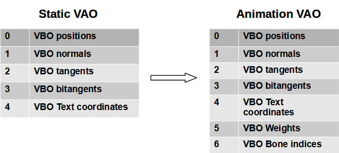

# Chapter 15 - Animations

Until now we have only loaded static 3D models, but in this chapter we will learn how to animate them. When thinking about animations the first approach is to create different meshes for each model positions, load them up into the GPU and draw them sequentially to create the illusion of movement. Although this approach is perfect for some games, it's not very efficient in terms of memory consumption. This where skeletal animation comes to play. We will learn how to load these models using [assimp](https://github.com/assimp/assimp).

You can find the complete source code for this chapter [here](https://github.com/lwjglgamedev/lwjglbook/tree/main/chapter-15).

## Anti-aliasing support

In this chapter we will add also support for anti-aliasing. Up to this moment you may have seen saw-like edges in the models. In order to remove those effects, we will apply anti-aliasing which basically uses the values of several samples to construct the final value for each pixel. In our case, we will use four sampled values. We need to set up this as a window hint prior to image creation (and add a new window option to control that):

```java
public class Window {
    ...
    public Window(String title, WindowOptions opts, Callable<Void> resizeFunc) {
        ...
        if (opts.antiAliasing) {
            glfwWindowHint(GLFW_SAMPLES, 4);
        }
        glfwWindowHint(GLFW_CONTEXT_VERSION_MAJOR, 3);
        glfwWindowHint(GLFW_CONTEXT_VERSION_MINOR, 2);
        ...
    }
    ...
    public static class WindowOptions {
        public boolean antiAliasing;
        ...
    }
}
```

In the `Render` class we need to enable multi-sampling (in addition to that, we remove face culling to properly render the sample model):

```java
public class Render {
    ...
    public Render(Window window) {
        GL.createCapabilities();
        glEnable(GL_MULTISAMPLE);
        glEnable(GL_DEPTH_TEST);

        sceneRender = new SceneRender();
        guiRender = new GuiRender(window);
        skyBoxRender = new SkyBoxRender();
    }
    ...
}
```

## Introduction

In skeletal animation the way a model animates is defined by its underlying skeleton. A skeleton is defined by a hierarchy of special elements called bones. These bones are defined by their position and rotation. We have said also that it's a hierarchy, which means that the final position for each bones is affected by the position of their parents. For instance, think of a wrist: the position of a wrist is modified if a character moves the elbow and also if it moves the shoulder.

Bones do not need to represent a physical bone or articulation: they are artifacts that allow the creatives to model an animation. In addition to bones we still have vertices, the points that define the triangles that compose a 3D model. But in skeletal animation, vertices are drawn based on the position of the bones they relate to.

In this chapter I’ve consulted many different sources, but I have found two that provide a very good explanation about how to create an animated model. Theses sources can be consulted at:

* [http://www.3dgep.com/gpu-skinning-of-md5-models-in-opengl-and-cg/](http://www.3dgep.com/gpu-skinning-of-md5-models-in-opengl-and-cg/)
* [http://ogldev.atspace.co.uk/www/tutorial38/tutorial38.html](http://ogldev.atspace.co.uk/www/tutorial38/tutorial38.html)

If you load a model which contains animations with current code, you will get what is called the binding pose. You can try that (with code from previous chapter) and you will be able to see the 3D model perfectly. The binding pose defines the positions, normals, and texture coordinates of the model without being affected by animation at all. An animated model defines in essence the following additional information:

* A tree like structure, composed by bones, which define a hierarchy where we can compose transformations.
* Each mesh, besides containing information about vertex position, normals, etc, will include information about which bones does this vertex relate to (by using a bone index) and how much they are affected (that is modulating the effect by using a weight factor).
* A set of animation key frames which define the specific transformations that should be applied to each bone and by extension wil modify the associated vertices. A model can define several animations and each of them may be composed of several animation key frames. When animation we iterate over those key frames (which define a duration) and we can even interoperate between them. In essence, for a specific instant of time we are applying to each vertex the transformations associated to the related bones.

Let’s review first the structures handled by assimp that contain animation information. We will start first with the bones and weights information. For each `AIMesh`, we can access the vertices positions, texture coordinates and indices. Meshes store also a list of bones. Each bone is defined by the following attributes:

* A name.
* An offset matrix: This will used later to compute the final transformations that should be used by each bone.

Bones also point to a list of weights. Each weight is defined by the following attributes:

* A weight factor, that is, the number that will be used to modulate the influence of the bone’s transformation associated to each vertex.
* A vertex identifier, that is, the vertex associated to the current bone.

The following picture shows the relationships between all these elements.

.png>)

Therefore, each vertex, besides containing position, normals and texture coordinates will have now a set of indices (typically four values) of the bones that affect those vertices (`jointIndices`) and a set of weights that will modulate that effect. Each vertex will bve modified according to the transformation matrices associated to each joint in order to calculate final position. Therefore, we will need to augment the VAO associated to each mesh to hold that information as it is shown in the next figure.



Assimp scene object defines a Node's hierarchy. Each Node is defined by a name and a list of children nodes. Animations use these nodes to define the transformations that should be applied. This hierarchy defined is indeed the bones’ hierarchy. Every bone is a node, and has a parent, except the root node, and possible a set of children. There are special nodes that are not bones; they are used to group transformations, and should be handled when calculating the transformations. Another issue is that this Node's hierarchy is defined from the whole model: we do not have separate hierarchies for each mesh.

A scene also defines a set of animations. A single model can have more than one animation to model how a character walks, runs, etc. Each of these animations defines different transformations. An animation has the following attributes:

* A name.
* A duration. That is, the duration in time of the animation. The name may seem confusing since an animation is the list of transformations that should be applied to each node for each different frame.
* A list of animation channels. An animation channel contains, for a specific instant in time, the translation, rotation and scaling information that should be applied to each node. The class that models the data contained in the animation channels is the `AINodeAnim`. Animation channels could be assimilated as the key frames.

The following figure shows the relationships between all the elements described above.

.png>)

For a specific instant of time, for a frame, the transformation to be applied to a bone is the transformation defined in the animation channel for that instant, multiplied by the transformations of all the parent nodes up to the root node. Hence, we need to extract the information stored in the scene, the process is as follows:

* Construct the node hierarchy.
* For each animation, iterate over each animation channel (for each animation node) and construct the transformation matrices for each of the bones for all the potential animation frames. Those transformation matrices are a combination of the transformation matrix of the node associated to the bone and the bone transformation matrices.
* We start at the root node, and for each frame, build the transformation matrix for that node, which is the transformation matrix of the node multiplied by the composition of the translation, rotation and scale matrix of that specific frame for that node.
* We then get the bones associated to that node and complement that transformation by multiplying the offset matrices of the bones. The result will be a transformation matrix associated with the related bones for that specific frame, which will be used in the shaders.
* After that, we iterate over the children nodes, passing the transformation matrix of the parent node to also be used in combination with the children node transformations.

## Implementation

Let's start by analyzing the changes in the `ModelLoader` class:

```java
public class ModelLoader {

    public static final int MAX_BONES = 150;
    private static final Matrix4f IDENTITY_MATRIX = new Matrix4f();
    ...
    public static Model loadModel(String modelId, String modelPath, TextureCache textureCache, boolean animation) {
        return loadModel(modelId, modelPath, textureCache, aiProcess_GenSmoothNormals | aiProcess_JoinIdenticalVertices |
                aiProcess_Triangulate | aiProcess_FixInfacingNormals | aiProcess_CalcTangentSpace | aiProcess_LimitBoneWeights |
                (animation ? 0 : aiProcess_PreTransformVertices));

    }
    ...
}
```

We need an extra argument (named `animation`) in the `loadModel` method to indicate whether we are loading a model with animations or not. If so, we cannot use the `aiProcess_PreTransformVertices` flag. This flag performs some transformation over the data loaded so the model is placed in the origin and the coordinates are corrected to math OpenGL coordinate System. We cannot use this flag for animated models because it removes animation data information.

While processing the meshes, we will also process the associated bones and weights for each vertex, storing the list of bones so we can later on build the required transformations:

```java
public class ModelLoader {
    ...
    public static Model loadModel(String modelId, String modelPath, TextureCache textureCache, int flags) {
        ...
        List<Bone> boneList = new ArrayList<>();
        for (int i = 0; i < numMeshes; i++) {
            AIMesh aiMesh = AIMesh.create(aiMeshes.get(i));
            Mesh mesh = processMesh(aiMesh, boneList);
            ...
        }
        ...
    }
    ...
    private static Mesh processMesh(AIMesh aiMesh, List<Bone> boneList) {
        ...
        AnimMeshData animMeshData = processBones(aiMesh, boneList);
        ...
        return new Mesh(vertices, normals, tangents, bitangents, textCoords, indices, animMeshData.boneIds, animMeshData.weights);
    }
    ...
}
```

The new method `processBones` is defined like this:

```java
public class ModelLoader {
    ...
    private static AnimMeshData processBones(AIMesh aiMesh, List<Bone> boneList) {
        List<Integer> boneIds = new ArrayList<>();
        List<Float> weights = new ArrayList<>();

        Map<Integer, List<VertexWeight>> weightSet = new HashMap<>();
        int numBones = aiMesh.mNumBones();
        PointerBuffer aiBones = aiMesh.mBones();
        for (int i = 0; i < numBones; i++) {
            AIBone aiBone = AIBone.create(aiBones.get(i));
            int id = boneList.size();
            Bone bone = new Bone(id, aiBone.mName().dataString(), toMatrix(aiBone.mOffsetMatrix()));
            boneList.add(bone);
            int numWeights = aiBone.mNumWeights();
            AIVertexWeight.Buffer aiWeights = aiBone.mWeights();
            for (int j = 0; j < numWeights; j++) {
                AIVertexWeight aiWeight = aiWeights.get(j);
                VertexWeight vw = new VertexWeight(bone.boneId(), aiWeight.mVertexId(),
                        aiWeight.mWeight());
                List<VertexWeight> vertexWeightList = weightSet.get(vw.vertexId());
                if (vertexWeightList == null) {
                    vertexWeightList = new ArrayList<>();
                    weightSet.put(vw.vertexId(), vertexWeightList);
                }
                vertexWeightList.add(vw);
            }
        }

        int numVertices = aiMesh.mNumVertices();
        for (int i = 0; i < numVertices; i++) {
            List<VertexWeight> vertexWeightList = weightSet.get(i);
            int size = vertexWeightList != null ? vertexWeightList.size() : 0;
            for (int j = 0; j < Mesh.MAX_WEIGHTS; j++) {
                if (j < size) {
                    VertexWeight vw = vertexWeightList.get(j);
                    weights.add(vw.weight());
                    boneIds.add(vw.boneId());
                } else {
                    weights.add(0.0f);
                    boneIds.add(0);
                }
            }
        }

        return new AnimMeshData(Utils.listFloatToArray(weights), Utils.listIntToArray(boneIds));
    }
    ...
}
```

This method traverses the bone definition for a specific mesh, getting their weights and filling up three lists:

* `boneList`: It contains a list of bones, with their offset matrices. It will be used later on to calculate the final bones transformations. A new class named `Bone` has been created to hold that information. This list will contain the bones for all the meshes.
* `boneIds`: It contains just the identifiers of the bones for each vertex of the `Mesh`. Bones are identified by its position when rendering. This list only contains the bones for a specific Mesh.
* `weights`: It contains the weights for each vertex of the `Mesh` to be applied for the associated bones.

The information retrieved in this method is encapsulated in the `AnimMeshData` record (defined inside the `ModelLoader` class). The new `Bone` and `VertexWeight` classes are also records. They are defined like this:

```java
public class ModelLoader {
    ...
    public record AnimMeshData(float[] weights, int[] boneIds) {
    }

    private record Bone(int boneId, String boneName, Matrix4f offsetMatrix) {
    }

    private record VertexWeight(int boneId, int vertexId, float weight) {
    }
}
```

We also have created two new methods in the `Utils` class to transform `List` of `float`s and `int`s to an array:

```java
public class Utils {
    ...
    public static float[] listFloatToArray(List<Float> list) {
        int size = list != null ? list.size() : 0;
        float[] floatArr = new float[size];
        for (int i = 0; i < size; i++) {
            floatArr[i] = list.get(i);
        }
        return floatArr;
    }

    public static int[] listIntToArray(List<Integer> list) {
        return list.stream().mapToInt((Integer v) -> v).toArray();
    }
    ...
}
```

Going back to the `loadModel` method, when we have processed the meshes and the materials we will process the animation data (that is the different animation key frames associated to each animation and their transformations. All that information is also stored in the `Model` class:

```java
public class ModelLoader {
    ...
    public static Model loadModel(String modelId, String modelPath, TextureCache textureCache, int flags) {
        ...
        List<Model.Animation> animations = new ArrayList<>();
        int numAnimations = aiScene.mNumAnimations();
        if (numAnimations > 0) {
            Node rootNode = buildNodesTree(aiScene.mRootNode(), null);
            Matrix4f globalInverseTransformation = toMatrix(aiScene.mRootNode().mTransformation()).invert();
            animations = processAnimations(aiScene, boneList, rootNode, globalInverseTransformation);
        }

        aiReleaseImport(aiScene);

        return new Model(modelId, materialList, animations);
    }
    ...
}
```

The `buildNodesTree` method is quite simple, It just traverses the node's hierarchy starting from the root node, constructing a tree of nodes:

```java
public class ModelLoader {
    ...
    private static Node buildNodesTree(AINode aiNode, Node parentNode) {
        String nodeName = aiNode.mName().dataString();
        Node node = new Node(nodeName, parentNode, toMatrix(aiNode.mTransformation()));

        int numChildren = aiNode.mNumChildren();
        PointerBuffer aiChildren = aiNode.mChildren();
        for (int i = 0; i < numChildren; i++) {
            AINode aiChildNode = AINode.create(aiChildren.get(i));
            Node childNode = buildNodesTree(aiChildNode, node);
            node.addChild(childNode);
        }
        return node;
    }
    ...
}
```

The `toMatrix` method just transforms an assimp matrix to a JOML one:

```java
public class ModelLoader {
    ...
    private static Matrix4f toMatrix(AIMatrix4x4 aiMatrix4x4) {
        Matrix4f result = new Matrix4f();
        result.m00(aiMatrix4x4.a1());
        result.m10(aiMatrix4x4.a2());
        result.m20(aiMatrix4x4.a3());
        result.m30(aiMatrix4x4.a4());
        result.m01(aiMatrix4x4.b1());
        result.m11(aiMatrix4x4.b2());
        result.m21(aiMatrix4x4.b3());
        result.m31(aiMatrix4x4.b4());
        result.m02(aiMatrix4x4.c1());
        result.m12(aiMatrix4x4.c2());
        result.m22(aiMatrix4x4.c3());
        result.m32(aiMatrix4x4.c4());
        result.m03(aiMatrix4x4.d1());
        result.m13(aiMatrix4x4.d2());
        result.m23(aiMatrix4x4.d3());
        result.m33(aiMatrix4x4.d4());

        return result;
    }
    ...
}
```

The `processAnimations` method is defined like this:

```java
public class ModelLoader {
    ...
    private static List<Model.Animation> processAnimations(AIScene aiScene, List<Bone> boneList,
                                                           Node rootNode, Matrix4f globalInverseTransformation) {
        List<Model.Animation> animations = new ArrayList<>();

        // Process all animations
        int numAnimations = aiScene.mNumAnimations();
        PointerBuffer aiAnimations = aiScene.mAnimations();
        for (int i = 0; i < numAnimations; i++) {
            AIAnimation aiAnimation = AIAnimation.create(aiAnimations.get(i));
            int maxFrames = calcAnimationMaxFrames(aiAnimation);

            List<Model.AnimatedFrame> frames = new ArrayList<>();
            Model.Animation animation = new Model.Animation(aiAnimation.mName().dataString(), aiAnimation.mDuration(), frames);
            animations.add(animation);

            for (int j = 0; j < maxFrames; j++) {
                Matrix4f[] boneMatrices = new Matrix4f[MAX_BONES];
                Arrays.fill(boneMatrices, IDENTITY_MATRIX);
                Model.AnimatedFrame animatedFrame = new Model.AnimatedFrame(boneMatrices);
                buildFrameMatrices(aiAnimation, boneList, animatedFrame, j, rootNode,
                        rootNode.getNodeTransformation(), globalInverseTransformation);
                frames.add(animatedFrame);
            }
        }
        return animations;
    }
    ...
}
```

This method returns a `List` of `Model.Animation` instances. Remember that a model can have more than one animation, so they are stored by their index. For each of these animations, we construct a list of animation frames (`Model.AnimatedFrame` instances), which are essentially a list of the transformation matrices to be applied to each of the bones that compose the model. For each animation, we calculate the maximum number of frames by calling the method `calcAnimationMaxFrames`, which is defined like this:

```java
public class ModelLoader {
    ...
    private static int calcAnimationMaxFrames(AIAnimation aiAnimation) {
        int maxFrames = 0;
        int numNodeAnims = aiAnimation.mNumChannels();
        PointerBuffer aiChannels = aiAnimation.mChannels();
        for (int i = 0; i < numNodeAnims; i++) {
            AINodeAnim aiNodeAnim = AINodeAnim.create(aiChannels.get(i));
            int numFrames = Math.max(Math.max(aiNodeAnim.mNumPositionKeys(), aiNodeAnim.mNumScalingKeys()),
                    aiNodeAnim.mNumRotationKeys());
            maxFrames = Math.max(maxFrames, numFrames);
        }

        return maxFrames;
    }
    ...
}
```

Before continuing to review the changes in the `ModelLoader` class, let's review the changes in the `Model` class to hold animation information:

```java
public class Model {
    ...
    private List<Animation> animationList;
    ...
    public Model(String id, List<Material> materialList, List<Animation> animationList) {
        entitiesList = new ArrayList<>();
        this.id = id;
        this.materialList = materialList;
        this.animationList = animationList;
    }
    ...
    public List<Animation> getAnimationList() {
        return animationList;
    }
    ...
    public record AnimatedFrame(Matrix4f[] boneMatrices) {
    }

    public record Animation(String name, double duration, List<AnimatedFrame> frames) {
    }
}
```

As you can see, we store the list of animations associated to the model, each animation defined by a name, a duration and a list of animation frames, which in essence just stores the bone transformation matrices to be applied for each bone.

Back to the `ModelLoader` class, each `AINodeAnim` instance defines some transformations to be applied to a node in the model for a specific frame. These transformations, for a specific node, are defined in the `AINodeAnim` instance. These transformations are defined in the form of position translations, rotations and scaling values. The trick here is that, for example, for a specific node, translation values can stop at a specific frame, but rotations and scaling values can continue for the next frames. In this case, we will have less translation values than rotation or scaling ones. Therefore, a good approximation to calculate the maximum number of frames is to use the maximum value. The problem gets more complex, because this is defined per node. A node can just define some transformations for the first frames and not apply more modifications for the rest. In this case, we should always use the last defined values. Therefore, we get the maximum number for all the animations associated to the nodes.

Going back to the `processAnimations` method, with that information, we are ready to iterate over the different frames and build the transformation matrices for the bones by calling the `buildFrameMatrices` method. For each frame, we start with the root node, and will apply the transformations recursively from top to bottom of the nodes hierarchy. The `buildFrameMatrices` is defined like this:

```java
public class ModelLoader {
    ...
    private static void buildFrameMatrices(AIAnimation aiAnimation, List<Bone> boneList, Model.AnimatedFrame animatedFrame,
                                           int frame, Node node, Matrix4f parentTransformation, Matrix4f globalInverseTransform) {
        String nodeName = node.getName();
        AINodeAnim aiNodeAnim = findAIAnimNode(aiAnimation, nodeName);
        Matrix4f nodeTransform = node.getNodeTransformation();
        if (aiNodeAnim != null) {
            nodeTransform = buildNodeTransformationMatrix(aiNodeAnim, frame);
        }
        Matrix4f nodeGlobalTransform = new Matrix4f(parentTransformation).mul(nodeTransform);

        List<Bone> affectedBones = boneList.stream().filter(b -> b.boneName().equals(nodeName)).toList();
        for (Bone bone : affectedBones) {
            Matrix4f boneTransform = new Matrix4f(globalInverseTransform).mul(nodeGlobalTransform).
                    mul(bone.offsetMatrix());
            animatedFrame.boneMatrices()[bone.boneId()] = boneTransform;
        }

        for (Node childNode : node.getChildren()) {
            buildFrameMatrices(aiAnimation, boneList, animatedFrame, frame, childNode, nodeGlobalTransform,
                    globalInverseTransform);
        }
    }
    ...
}
```

We get the transformation associated to the node. Then we check if this node has an animation node associated to it. If so, we need to get the proper translation, rotation and scaling transformations that apply to the frame we are handling. With that information, we get the bones associated to that node and update the transformation matrix for each of those bones for that specific frame by multiplying:

* The model inverse global transformation matrix (the inverse of the root node transformation matrix).
* The transformation matrix for the node.
* The bone offset matrix.

After that, we iterate over the children nodes, using the node transformation matrix as the parent matrix for those child nodes.

```java
public class ModelLoader {
    ...
    private static Matrix4f buildNodeTransformationMatrix(AINodeAnim aiNodeAnim, int frame) {
        AIVectorKey.Buffer positionKeys = aiNodeAnim.mPositionKeys();
        AIVectorKey.Buffer scalingKeys = aiNodeAnim.mScalingKeys();
        AIQuatKey.Buffer rotationKeys = aiNodeAnim.mRotationKeys();

        AIVectorKey aiVecKey;
        AIVector3D vec;

        Matrix4f nodeTransform = new Matrix4f();
        int numPositions = aiNodeAnim.mNumPositionKeys();
        if (numPositions > 0) {
            aiVecKey = positionKeys.get(Math.min(numPositions - 1, frame));
            vec = aiVecKey.mValue();
            nodeTransform.translate(vec.x(), vec.y(), vec.z());
        }
        int numRotations = aiNodeAnim.mNumRotationKeys();
        if (numRotations > 0) {
            AIQuatKey quatKey = rotationKeys.get(Math.min(numRotations - 1, frame));
            AIQuaternion aiQuat = quatKey.mValue();
            Quaternionf quat = new Quaternionf(aiQuat.x(), aiQuat.y(), aiQuat.z(), aiQuat.w());
            nodeTransform.rotate(quat);
        }
        int numScalingKeys = aiNodeAnim.mNumScalingKeys();
        if (numScalingKeys > 0) {
            aiVecKey = scalingKeys.get(Math.min(numScalingKeys - 1, frame));
            vec = aiVecKey.mValue();
            nodeTransform.scale(vec.x(), vec.y(), vec.z());
        }

        return nodeTransform;
    }
    ...
}
```

The `AINodeAnim` instance defines a set of keys that contain translation, rotation and scaling information. These keys are referred to specific instants of time. We assume that information is ordered by time, and construct a list of matrices that contain the transformation to be applied for each frame. As said before, some of those transformations may "stop" at a specific frame, so we should use the last values for the last of the frames.

The `findAIAnimNode` method is defined like this:

```java
public class ModelLoader {
    ...
    private static AINodeAnim findAIAnimNode(AIAnimation aiAnimation, String nodeName) {
        AINodeAnim result = null;
        int numAnimNodes = aiAnimation.mNumChannels();
        PointerBuffer aiChannels = aiAnimation.mChannels();
        for (int i = 0; i < numAnimNodes; i++) {
            AINodeAnim aiNodeAnim = AINodeAnim.create(aiChannels.get(i));
            if (nodeName.equals(aiNodeAnim.mNodeName().dataString())) {
                result = aiNodeAnim;
                break;
            }
        }
        return result;
    }
    ...
}
```

The `Mesh` class needs to be updated to allocate the new VBOs for bone indices and bone weights. You will see that we use a maximum of four weights (and the associated bone indices per vertex)

```java
public class Mesh {

    public static final int MAX_WEIGHTS = 4;
    ...
    public Mesh(float[] positions, float[] normals, float[] tangents, float[] bitangents, float[] textCoords, int[] indices) {
        this(positions, normals, tangents, bitangents, textCoords, indices,
                new int[Mesh.MAX_WEIGHTS * positions.length / 3], new float[Mesh.MAX_WEIGHTS * positions.length / 3]);
    }

    public Mesh(float[] positions, float[] normals, float[] tangents, float[] bitangents, float[] textCoords, int[] indices,
                int[] boneIndices, float[] weights) {
        ...
        // Bone weights
        vboId = glGenBuffers();
        vboIdList.add(vboId);
        FloatBuffer weightsBuffer = MemoryUtil.memCallocFloat(weights.length);
        weightsBuffer.put(weights).flip();
        glBindBuffer(GL_ARRAY_BUFFER, vboId);
        glBufferData(GL_ARRAY_BUFFER, weightsBuffer, GL_STATIC_DRAW);
        glEnableVertexAttribArray(5);
        glVertexAttribPointer(5, 4, GL_FLOAT, false, 0, 0);

        // Bone indices
        vboId = glGenBuffers();
        vboIdList.add(vboId);
        IntBuffer boneIndicesBuffer = MemoryUtil.memCallocInt(boneIndices.length);
        boneIndicesBuffer.put(boneIndices).flip();
        glBindBuffer(GL_ARRAY_BUFFER, vboId);
        glBufferData(GL_ARRAY_BUFFER, boneIndicesBuffer, GL_STATIC_DRAW);
        glEnableVertexAttribArray(6);
        glVertexAttribPointer(6, 4, GL_FLOAT, false, 0, 0);
        ...
        MemoryUtil.memFree(weightsBuffer);
        MemoryUtil.memFree(boneIndicesBuffer);
        ...
    }
    ...
}
```

The `Node` class just stores the data associated to an `AINode` and has specific methods to manage its children:

```java
package org.lwjglb.engine.scene;

import org.joml.Matrix4f;

import java.util.*;

public class Node {
    private final List<Node> children;

    private final String name;

    private final Node parent;

    private Matrix4f nodeTransformation;

    public Node(String name, Node parent, Matrix4f nodeTransformation) {
        this.name = name;
        this.parent = parent;
        this.nodeTransformation = nodeTransformation;
        this.children = new ArrayList<>();
    }

    public void addChild(Node node) {
        this.children.add(node);
    }

    public List<Node> getChildren() {
        return children;
    }

    public String getName() {
        return name;
    }

    public Matrix4f getNodeTransformation() {
        return nodeTransformation;
    }

    public Node getParent() {
        return parent;
    }
}
```

Now we can view how we render animated models and how they can coexist with static ones. Let's start with the `SceneRender` class. In this class we just need to set up a new uniform to pass the bones matrices (assigned to current animation frame) so they can be used in the shader. Besides that, the render of static and animated entities do not have any additional impact over this class.

```java
public class SceneRender {
    ...
    private void createUniforms() {
        ...
        uniformsMap.createUniform("bonesMatrices");
        ...
    }

    public void render(Scene scene) {
        ...
        for (Model model : models) {
            List<Entity> entities = model.getEntitiesList();

            for (Material material : model.getMaterialList()) {
                ...
                for (Mesh mesh : material.getMeshList()) {
                    glBindVertexArray(mesh.getVaoId());
                    for (Entity entity : entities) {
                        uniformsMap.setUniform("modelMatrix", entity.getModelMatrix());
                        AnimationData animationData = entity.getAnimationData();
                        if (animationData == null) {
                            uniformsMap.setUniform("bonesMatrices", AnimationData.DEFAULT_BONES_MATRICES);
                        } else {
                            uniformsMap.setUniform("bonesMatrices", animationData.getCurrentFrame().boneMatrices());
                        }
                        glDrawElements(GL_TRIANGLES, mesh.getNumVertices(), GL_UNSIGNED_INT, 0);
                    }
                }
            }
        }
    }
    ...
}
```

For static models, we will pass an array of matrices set to null. We also need to modify the `UniformsMap` to add a new method to set up the values for an array of matrices:

```java
public class UniformsMap {
    ...
    public void setUniform(String uniformName, Matrix4f[] matrices) {
        try (MemoryStack stack = MemoryStack.stackPush()) {
            int length = matrices != null ? matrices.length : 0;
            FloatBuffer fb = stack.mallocFloat(16 * length);
            for (int i = 0; i < length; i++) {
                matrices[i].get(16 * i, fb);
            }
            glUniformMatrix4fv(uniforms.get(uniformName), false, fb);
        }
    }
}
```

We also have created a new class named `AnimationData` to control the current animation set to an `Entity`:

```java
package org.lwjglb.engine.scene;

import org.joml.Matrix4f;
import org.lwjglb.engine.graph.Model;

public class AnimationData {

    public static final Matrix4f[] DEFAULT_BONES_MATRICES = new Matrix4f[ModelLoader.MAX_BONES];

    static {
        Matrix4f zeroMatrix = new Matrix4f().zero();
        Arrays.fill(DEFAULT_BONES_MATRICES, zeroMatrix);
    }

    private Model.Animation currentAnimation;
    private int currentFrameIdx;

    public AnimationData(Model.Animation currentAnimation) {
        currentFrameIdx = 0;
        this.currentAnimation = currentAnimation;
    }

    public Model.Animation getCurrentAnimation() {
        return currentAnimation;
    }

    public Model.AnimatedFrame getCurrentFrame() {
        return currentAnimation.frames().get(currentFrameIdx);
    }

    public int getCurrentFrameIdx() {
        return currentFrameIdx;
    }

    public void nextFrame() {
        int nextFrame = currentFrameIdx + 1;
        if (nextFrame > currentAnimation.frames().size() - 1) {
            currentFrameIdx = 0;
        } else {
            currentFrameIdx = nextFrame;
        }
    }

    public void setCurrentAnimation(Model.Animation currentAnimation) {
        currentFrameIdx = 0;
        this.currentAnimation = currentAnimation;
    }
}
```

An of course, we need to modify the `Entity` class to hold a reference to the `AnimationData` instance:

```java
public class Entity {
    ...
    private AnimationData animationData;
    ...
    public AnimationData getAnimationData() {
        return animationData;
    }
    ...
    public void setAnimationData(AnimationData animationData) {
        this.animationData = animationData;
    }
    ...
}
```

We need to modify the scene vertex shader (`scene.vert`) to put into play animation data. We start by defining some constants and the new input attributes for bone weights and indices (we are using four elements per vertex so we use `vec4` and `ivec4`). We also pass the bone matrices associated to current animation as a uniform.

```glsl
#version 330

const int MAX_WEIGHTS = 4;
const int MAX_BONES = 150;

layout (location=0) in vec3 position;
layout (location=1) in vec3 normal;
layout (location=2) in vec3 tangent;
layout (location=3) in vec3 bitangent;
layout (location=4) in vec2 texCoord;
layout (location=5) in vec4 boneWeights;
layout (location=6) in ivec4 boneIndices;
...
uniform mat4 bonesMatrices[MAX_BONES];
...
```

In the `main` function we will iterate over the bone weights and modify the position and normals using the matrices designated by the associated bone indices and modulated by the associated weights. You can think about it as if each bone would contribute to position (and normals) modification but modulated by using the weights. If we are using static models, the weights would be zero so we will stick to original position and normals values.

```glsl
...
void main()
{
    vec4 initPos = vec4(0, 0, 0, 0);
    vec4 initNormal = vec4(0, 0, 0, 0);
    vec4 initTangent = vec4(0, 0, 0, 0);
    vec4 initBitangent = vec4(0, 0, 0, 0);

    int count = 0;
    for (int i = 0; i < MAX_WEIGHTS; i++) {
        float weight = boneWeights[i];
        if (weight > 0) {
            count++;
            int boneIndex = boneIndices[i];
            vec4 tmpPos = bonesMatrices[boneIndex] * vec4(position, 1.0);
            initPos += weight * tmpPos;

            vec4 tmpNormal = bonesMatrices[boneIndex] * vec4(normal, 0.0);
            initNormal += weight * tmpNormal;

            vec4 tmpTangent = bonesMatrices[boneIndex] * vec4(tangent, 0.0);
            initTangent += weight * tmpTangent;

            vec4 tmpBitangent = bonesMatrices[boneIndex] * vec4(bitangent, 0.0);
            initBitangent += weight * tmpBitangent;
        }
    }
    if (count == 0) {
        initPos = vec4(position, 1.0);
        initNormal = vec4(normal, 0.0);
        initTangent = vec4(tangent, 0.0);
        initBitangent = vec4(bitangent, 0.0);
    }

    mat4 modelViewMatrix = viewMatrix * modelMatrix;
    vec4 mvPosition =  modelViewMatrix * initPos;
    gl_Position   = projectionMatrix * mvPosition;
    outPosition   = mvPosition.xyz;
    outNormal     = normalize(modelViewMatrix * initNormal).xyz;
    outTangent    = normalize(modelViewMatrix * initTangent).xyz;
    outBitangent  = normalize(modelViewMatrix * initBitangent).xyz;
    outTextCoord  = texCoord;
}
```

The following figure depicts the process.


In the `Main` class we need to load animation models and activate anti-aliasing. We will also increment the animation frame each update:

```java
public class Main implements IAppLogic {
    ...
    private AnimationData animationData;
    ...
    public static void main(String[] args) {
        Main main = new Main();
        Window.WindowOptions opts = new Window.WindowOptions();
        opts.antiAliasing = true;
        Engine gameEng = new Engine("chapter-15", opts, main);
        gameEng.start();
    }
    ...
    @Override
    public void init(Window window, Scene scene, Render render) {
        String terrainModelId = "terrain";
        Model terrainModel = ModelLoader.loadModel(terrainModelId, "resources/models/terrain/terrain.obj",
                scene.getTextureCache(), false);
        scene.addModel(terrainModel);
        Entity terrainEntity = new Entity("terrainEntity", terrainModelId);
        terrainEntity.setScale(100.0f);
        terrainEntity.updateModelMatrix();
        scene.addEntity(terrainEntity);

        String bobModelId = "bobModel";
        Model bobModel = ModelLoader.loadModel(bobModelId, "resources/models/bob/boblamp.md5mesh",
                scene.getTextureCache(), true);
        scene.addModel(bobModel);
        Entity bobEntity = new Entity("bobEntity", bobModelId);
        bobEntity.setScale(0.05f);
        bobEntity.updateModelMatrix();
        animationData = new AnimationData(bobModel.getAnimationList().get(0));
        bobEntity.setAnimationData(animationData);
        scene.addEntity(bobEntity);

        SceneLights sceneLights = new SceneLights();
        AmbientLight ambientLight = sceneLights.getAmbientLight();
        ambientLight.setIntensity(0.5f);
        ambientLight.setColor(0.3f, 0.3f, 0.3f);

        DirLight dirLight = sceneLights.getDirLight();
        dirLight.setPosition(0, 1, 0);
        dirLight.setIntensity(1.0f);
        scene.setSceneLights(sceneLights);

        SkyBox skyBox = new SkyBox("resources/models/skybox/skybox.obj", scene.getTextureCache());
        skyBox.getSkyBoxEntity().setScale(100);
        skyBox.getSkyBoxEntity().updateModelMatrix();
        scene.setSkyBox(skyBox);

        scene.setFog(new Fog(true, new Vector3f(0.5f, 0.5f, 0.5f), 0.02f));

        Camera camera = scene.getCamera();
        camera.setPosition(-1.5f, 3.0f, 4.5f);
        camera.addRotation((float) Math.toRadians(15.0f), (float) Math.toRadians(390.f));

        lightAngle = 0;
    }
    ...
    @Override
    public void update(Window window, Scene scene, long diffTimeMillis) {
        animationData.nextFrame();
    }
}
```

Finally, we also need to modify the `SkyBox` class since the `loadModel` method from the `ModelLoader` class has changes:

```java
public class SkyBox {
    ...
    public SkyBox(String skyBoxModelPath, TextureCache textureCache) {
        skyBoxModel = ModelLoader.loadModel("skybox-model", skyBoxModelPath, textureCache, false);
        ...
    }
}
```

You will be able to see something like this:

.png>)

[Next chapter](../chapter-16/chapter-16.md)
