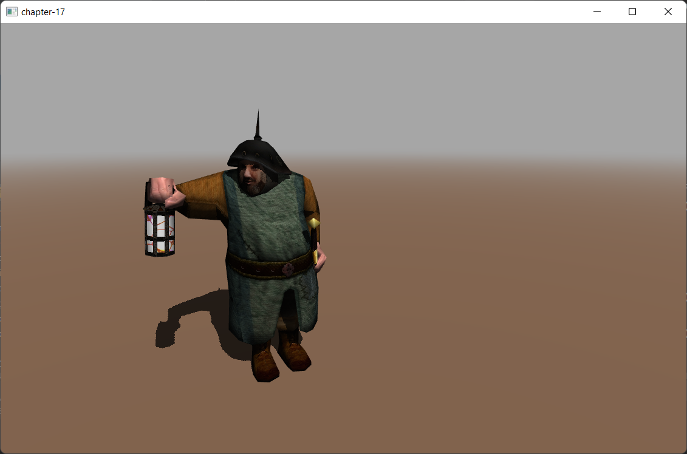

# Chapter 17 - Shadows

Currently we are able to represent how light affects the objects in a 3D scene. Objects that get more light are shown brighter than objects that do not receive light. However we are still not able to cast shadows. Shadows will increase the degree of realism of a 3D scene. This is what we will do in this chapter.

You can find the complete source code for this chapter [here](https://github.com/lwjglgamedev/lwjglbook/tree/main/chapter-17).

## Shadow Mapping

We will use a technique named Shadow mapping which is widely used in games and does not severely affect the engine performance. Shadow mapping may seem simple to understand but it’s somehow difficult to implement correctly. Or, to be more precise, it’s very difficult to implement it in a general way that covers all the potential cases and produces consistent results.

So let’s start by thinking how we could check if a specific area \(indeed a fragment\) is in shadow or not. While drawing that area if we can cast rays to the light source and reach the light source without any collision then that pixel is in light. If not, the pixel is in shadow.

The following picture shows the case for a point light: point PA can reach the source light, but points PB and PC can’t so they are in shadow.


How we can check in an efficient manner if we can cast that ray without collisions? A light source can theoretically cast infinitely ray lights, so how do we check if a ray light is blocked or not?
What we can do instead of casting ray lights is to look at the 3D scene from the light’s perspective and render the scene from that location. We can set the camera at the light position and render the scene so we can store the depth for each fragment. This is equivalent to calculate the distance of each fragment to the light source. At the end, what we are doing is storing the minimum distance as seen from the light source as a shadow map.

The following picture shows a cube floating over a plane and  a perpendicular light.


The scene as seen from the light perspective would be something like this \(the darker the color, the closer to the light source\).


With that information we can render the 3D scene as usual and check the distance for each fragment to the light source with the minimum stored distance. If the distance is less that the value stored in the shadow map, then the object is in light, otherwise it's in shadow. We can have several objects that could be hit by the same ray light, but we store the minimum distance.

Thus, shadow mapping is a two step process:

* First we render the scene from the light space into a shadow map to get the minimum distances.
* Second we render the scene from the camera point of view and use that depth  map to calculate if objects are in shadow or not.

In order to render the depth map we need to talk about the depth buffer. When we render a scene, all the depth information is stored in a buffer named, obviously, depth-buffer \(or z-buffer\). That depth information is the $$z$$ value of each of the fragment that is rendered. If you recall from the first chapters what we are doing while rendering a scene is transforming from world coordinates to screen coordinates. We are drawing to a coordinate space which ranges from $$0$$ to $$1$$ for $$x$$ and $$y$$ axis. If an object is more distant than another, we must calculate how this affects their $$x$$ and $$y$$ coordinates through the perspective projection matrix. This is not calculated automatically depending on the $$z$$ value, but must be done us. What is actually stored in the z coordinate is the depth of that fragment, nothing less and nothing more.

## Cascaded Shadow Maps

The solution presented above, as it is, does not produce quality results for open spaces. The reason for that is that shadows resolution is limited by the texture size. We are covering now a potentially huge area, and textures we are using to store depth information have not enough resolution in order to get good results. You may think that the solution is just to increase texture resolution, but this is not sufficient to completely fix the problem. You would need huge textures for that. Therefore, once explained the basis we will explain a technique called Cascaded Shadow Maps \(CSM\) which is an improvement over the plain shadow maps one.

The key concept is that, shadows of objects that are closer to the camera need to have a higher quality than shadows for distant objects. One approach could be to just render shadows for objects close to the camera, but this would cause shadows to appear / disappear as long as we move through the scene.

The approach that Cascaded Shadow Maps \(CSMs\) use is to divide the view frustum into several splits. Splits closer to the camera cover a smaller amount spaces whilst distant regions cover a much wider region of space. The next figure shows a view frustum divided into three splits.


For each of these splits, the depth map is rendered, adjusting the light view and projection matrices to cover fit to each split. Thus, the texture that stores the depth map covers a reduced area of the view frustum. And, since the split closest to the camera covers less space, the depth resolution is increased.

As it can be deduced from the explanation above, we will need as many depth textures as splits, and we will also change the light view and projection matrices for each of the. Hence, the steps to be done in order to apply CSMs are:

* Divide the view frustum into n splits.

* While rendering the depth map, for each split:

  * Calculate light view and projection matrices.

  * Render the scene from light’s perspective into a separate depth map

* While rendering the scene:

  * Use the depths maps calculated above.

  * Determine the split that the fragment to be drawn belongs to.

  * Calculate shadow factor as in shadow maps.

As you can see, the main drawback of CSMs is that we need to render the scene, from light’s perspective, for each split. This is why is often only used for open spaces (of course you can apply caching to shadow calculations to reduce overhead).

## Implementation

The first class that we will create will be responsible of calculating the matrices required to render the shadow maps from light perspective. The class is named `CascadeShadow` and will store the projection view matrix (from light perspective) for a specific cascade shadow split (`projViewMatrix` attribute) and the far plane distance for its ortho-projection matrix (`splitDistance` attribute):

```java
public class CascadeShadow {

    public static final int SHADOW_MAP_CASCADE_COUNT = 3;
    
    private Matrix4f projViewMatrix;
    private float splitDistance;

    public CascadeShadow() {
        projViewMatrix = new Matrix4f();
    }
    ...
    public Matrix4f getProjViewMatrix() {
        return projViewMatrix;
    }

    public float getSplitDistance() {
        return splitDistance;
    }
    ...
}
```

The `CascadeShadow` class defines a static method to initialize a list of cascade shadows instances with the proper values named `updateCascadeShadows`. This method starts like this:

```java
public class CascadeShadow {
    ...
    public static void updateCascadeShadows(List<CascadeShadow> cascadeShadows, Scene scene) {
        Matrix4f viewMatrix = scene.getCamera().getViewMatrix();
        Matrix4f projMatrix = scene.getProjection().getProjMatrix();
        Vector4f lightPos = new Vector4f(scene.getSceneLights().getDirLight().getDirection(), 0);

        float cascadeSplitLambda = 0.95f;

        float[] cascadeSplits = new float[SHADOW_MAP_CASCADE_COUNT];

        float nearClip = projMatrix.perspectiveNear();
        float farClip = projMatrix.perspectiveFar();
        float clipRange = farClip - nearClip;

        float minZ = nearClip;
        float maxZ = nearClip + clipRange;

        float range = maxZ - minZ;
        float ratio = maxZ / minZ;
        ...
    }
    ...
}
```

We start by retrieving the matrices that we will need to calculate the splits data, the view and projection matrices, the light position and the near and far clips of the perspective projection we are using to render the scene. With that information we can calculate the split distances for each of the shadow cascades:

```java
public class CascadeShadow {
    ...
    public static void updateCascadeShadows(List<CascadeShadow> cascadeShadows, Scene scene) {
        ...
        // Calculate split depths based on view camera frustum
        // Based on method presented in https://developer.nvidia.com/gpugems/GPUGems3/gpugems3_ch10.html
        for (int i = 0; i < SHADOW_MAP_CASCADE_COUNT; i++) {
            float p = (i + 1) / (float) (SHADOW_MAP_CASCADE_COUNT);
            float log = (float) (minZ * java.lang.Math.pow(ratio, p));
            float uniform = minZ + range * p;
            float d = cascadeSplitLambda * (log - uniform) + uniform;
            cascadeSplits[i] = (d - nearClip) / clipRange;
        }
        ...
    }
    ...
}
```

The algorithm used to calculate the split positions, uses a logarithm schema to better distribute the distances. We could just use other different approaches, such as splitting the cascades evenly, or according to a pre-set proportion,. The advantage of the logarithm schema is that it uses less space for near view splits, achieving a higher resolution for the elements closer to the camera. You can check the [NVIDIA article](https://developer.nvidia.com/gpugems/GPUGems3/gpugems3_ch10.html) for the math details. The `cascadeSplits` array will have a set of values in the range [0, 1] which we will use later on to perform the required calculations to get the split distances and the projection matrices for each cascade.

Now we define a loop to calculate all the data for the cascade splits. In that loop, we first create the frustum corners in NDC (Normalized Device Coordinates) space. After that, we project those coordinates into world space by using the inverse of the view and perspective matrices. Since we are using directional lights, we will use ortographic projection matrices for rendering the shadow maps, this is the reason why we set, as the NDC coordinates, just the limits of the cube that contains the visible volume (distant objects will not be rendered smaller, as in the perspective projection).

```java
public class CascadeShadow {
    ...
    public static void updateCascadeShadows(List<CascadeShadow> cascadeShadows, Scene scene) {
        ...
        // Calculate orthographic projection matrix for each cascade
        float lastSplitDist = 0.0f;
        for (int i = 0; i < SHADOW_MAP_CASCADE_COUNT; i++) {
            float splitDist = cascadeSplits[i];

            Vector3f[] frustumCorners = new Vector3f[]{
                    new Vector3f(-1.0f, 1.0f, -1.0f),
                    new Vector3f(1.0f, 1.0f, -1.0f),
                    new Vector3f(1.0f, -1.0f, -1.0f),
                    new Vector3f(-1.0f, -1.0f, -1.0f),
                    new Vector3f(-1.0f, 1.0f, 1.0f),
                    new Vector3f(1.0f, 1.0f, 1.0f),
                    new Vector3f(1.0f, -1.0f, 1.0f),
                    new Vector3f(-1.0f, -1.0f, 1.0f),
            };

            // Project frustum corners into world space
            Matrix4f invCam = (new Matrix4f(projMatrix).mul(viewMatrix)).invert();
            for (int j = 0; j < 8; j++) {
                Vector4f invCorner = new Vector4f(frustumCorners[j], 1.0f).mul(invCam);
                frustumCorners[j] = new Vector3f(invCorner.x / invCorner.w, invCorner.y / invCorner.w, invCorner.z / invCorner.w);
            }
            ...
        }
        ...
    }
    ...
}
```

At this point, `frustumCorners` variable has the coordinates of a cube which contains the visible space, but we need the world coordinates for this specific cascade split. Therefore, the next step is to put the cascade distances calculated at the beginning of them method into work. We adjust the coordinates of near and far planes for this specific split according to the pre-calculated distances:

```java
public class CascadeShadow {
    ...
    public static void updateCascadeShadows(List<CascadeShadow> cascadeShadows, Scene scene) {
        ...
        for (int i = 0; i < SHADOW_MAP_CASCADE_COUNT; i++) {
            ...
            for (int j = 0; j < 4; j++) {
                Vector3f dist = new Vector3f(frustumCorners[j + 4]).sub(frustumCorners[j]);
                frustumCorners[j + 4] = new Vector3f(frustumCorners[j]).add(new Vector3f(dist).mul(splitDist));
                frustumCorners[j] = new Vector3f(frustumCorners[j]).add(new Vector3f(dist).mul(lastSplitDist));
            }
            ...
        }
        ...
    }
    ...
}
```

After that, we calculate the coordinates of the center of that split (still working in world coordinates), and the radius of that split:

```java
public class CascadeShadow {
    ...
    public static void updateCascadeShadows(List<CascadeShadow> cascadeShadows, Scene scene) {
        ...
        for (int i = 0; i < SHADOW_MAP_CASCADE_COUNT; i++) {
            ...
            // Get frustum center
            Vector3f frustumCenter = new Vector3f(0.0f);
            for (int j = 0; j < 8; j++) {
                frustumCenter.add(frustumCorners[j]);
            }
            frustumCenter.div(8.0f);

            float radius = 0.0f;
            for (int j = 0; j < 8; j++) {
                float distance = (new Vector3f(frustumCorners[j]).sub(frustumCenter)).length();
                radius = java.lang.Math.max(radius, distance);
            }
            radius = (float) java.lang.Math.ceil(radius * 16.0f) / 16.0f;
            ...
        }
        ...
    }
    ...
}
```

With that information, we can now calculate the view matrix, from the light point of view and the orthographic projection matrix as well as the split distance (in camera view coordinates):

```java
public class CascadeShadow {
    ...
    public static void updateCascadeShadows(List<CascadeShadow> cascadeShadows, Scene scene) {
        ...
        for (int i = 0; i < SHADOW_MAP_CASCADE_COUNT; i++) {
            ...
            Vector3f maxExtents = new Vector3f(radius);
            Vector3f minExtents = new Vector3f(maxExtents).mul(-1);

            Vector3f lightDir = (new Vector3f(lightPos.x, lightPos.y, lightPos.z).mul(-1)).normalize();
            Vector3f eye = new Vector3f(frustumCenter).sub(new Vector3f(lightDir).mul(-minExtents.z));
            Vector3f up = new Vector3f(0.0f, 1.0f, 0.0f);
            Matrix4f lightViewMatrix = new Matrix4f().lookAt(eye, frustumCenter, up);
            Matrix4f lightOrthoMatrix = new Matrix4f().ortho
                    (minExtents.x, maxExtents.x, minExtents.y, maxExtents.y, 0.0f, maxExtents.z - minExtents.z, true);

            // Store split distance and matrix in cascade
            CascadeShadow cascadeShadow = cascadeShadows.get(i);
            cascadeShadow.splitDistance = (nearClip + splitDist * clipRange) * -1.0f;
            cascadeShadow.projViewMatrix = lightOrthoMatrix.mul(lightViewMatrix);

            lastSplitDist = cascadeSplits[i];
        }
        ...
    }
    ...
}
```
We have now completed the code that calculates the matrices required to render the shadow maps. Therefore, we can start coding the classes required to perform that rendering. In this case, we will be rendering to a different image (a depth image). We will need one texture per cascade map split. In order to manage that, we will create a new class named `ArrTexture` that will create a set of textures and it is defined like this:

```java
package org.lwjglb.engine.graph;

import java.nio.ByteBuffer;

import static org.lwjgl.opengl.GL11.*;
import static org.lwjgl.opengl.GL12.GL_CLAMP_TO_EDGE;
import static org.lwjgl.opengl.GL14.GL_TEXTURE_COMPARE_MODE;

public class ArrTexture {

    private final int[] ids;

    public ArrTexture(int numTextures, int width, int height, int pixelFormat) {
        ids = new int[numTextures];
        glGenTextures(ids);

        for (int i = 0; i < numTextures; i++) {
            glBindTexture(GL_TEXTURE_2D, ids[i]);
            glTexImage2D(GL_TEXTURE_2D, 0, GL_DEPTH_COMPONENT, width, height, 0, pixelFormat, GL_FLOAT, (ByteBuffer) null);
            glTexParameteri(GL_TEXTURE_2D, GL_TEXTURE_MIN_FILTER, GL_LINEAR);
            glTexParameteri(GL_TEXTURE_2D, GL_TEXTURE_MAG_FILTER, GL_LINEAR);
            glTexParameteri(GL_TEXTURE_2D, GL_TEXTURE_COMPARE_MODE, GL_NONE);
            glTexParameteri(GL_TEXTURE_2D, GL_TEXTURE_WRAP_S, GL_CLAMP_TO_EDGE);
            glTexParameteri(GL_TEXTURE_2D, GL_TEXTURE_WRAP_T, GL_CLAMP_TO_EDGE);
        }
    }

    public void cleanup() {
        for (int id : ids) {
            glDeleteTextures(id);
        }
    }

    public int[] getIds() {
        return ids;
    }
}
```

We set the texture wrapping mode to `GL_CLAMP_TO_EDGE` since we do not want the texture to repeat in case we exceed the $$[0, 1]$$ range.

So now that we are able to create empty textures, we need to be able to render a scene into it. In order to do that we need to use Frame Buffers Objects \(or FBOs\). A Frame Buffer is a collection of buffers that can be used as a destination for rendering. When we have been rendering to the screen we have using OpenGL’s default buffer. OpenGL allows us to render to user defined buffers by using FBOs. We will isolate the rest of the code of the process of creating FBOs for shadow mapping by creating a new class named `ShadowBuffer`. This is the definition of that class.

```java
package org.lwjglb.engine.graph;

import static org.lwjgl.opengl.GL11.*;
import static org.lwjgl.opengl.GL13.glActiveTexture;
import static org.lwjgl.opengl.GL30.*;

public class ShadowBuffer {

    public static final int SHADOW_MAP_WIDTH = 4096;

    public static final int SHADOW_MAP_HEIGHT = SHADOW_MAP_WIDTH;
    private final ArrTexture depthMap;
    private final int depthMapFBO;

    public ShadowBuffer() {
        // Create a FBO to render the depth map
        depthMapFBO = glGenFramebuffers();

        // Create the depth map textures
        depthMap = new ArrTexture(CascadeShadow.SHADOW_MAP_CASCADE_COUNT, SHADOW_MAP_WIDTH, SHADOW_MAP_HEIGHT, GL_DEPTH_COMPONENT);

        // Attach the the depth map texture to the FBO
        glBindFramebuffer(GL_FRAMEBUFFER, depthMapFBO);
        glFramebufferTexture2D(GL_FRAMEBUFFER, GL_DEPTH_ATTACHMENT, GL_TEXTURE_2D, depthMap.getIds()[0], 0);

        // Set only depth
        glDrawBuffer(GL_NONE);
        glReadBuffer(GL_NONE);

        if (glCheckFramebufferStatus(GL_FRAMEBUFFER) != GL_FRAMEBUFFER_COMPLETE) {
            throw new RuntimeException("Could not create FrameBuffer");
        }

        // Unbind
        glBindFramebuffer(GL_FRAMEBUFFER, 0);
    }

    public void bindTextures(int start) {
        for (int i = 0; i < CascadeShadow.SHADOW_MAP_CASCADE_COUNT; i++) {
            glActiveTexture(start + i);
            glBindTexture(GL_TEXTURE_2D, depthMap.getIds()[i]);
        }
    }

    public void cleanup() {
        glDeleteFramebuffers(depthMapFBO);
        depthMap.cleanup();
    }

    public int getDepthMapFBO() {
        return depthMapFBO;
    }

    public ArrTexture getDepthMapTexture() {
        return depthMap;
    }
}
```

The `ShadowBuffer` class defines two constants that determine the size of the texture that will  hold the depth map. It also defines two attributes, one for the FBO and one for the texture. In the constructor, we create a new FBO and an array of textures. Each elements of that array will be used to render a shadow map for each cascade shadow split. For the FBO we will use as the pixel format the constant `GL_DEPTH_COMPONENT` since we are only interested in storing depth values. Then we attach the FBO to the texture instance.

The following lines explicitly set the FBO to not render any color. A FBO needs a color buffer, but we are not going to needed. This is why we set the color buffers to be used as `GL_NONE`.

Now we can put all the previous classes to work in order to render the shadow maps. We will be doing this in a new class named `ShadowRender` which starts like this:

```java
package org.lwjglb.engine.graph;

import org.lwjglb.engine.scene.*;

import java.util.*;

import static org.lwjgl.opengl.GL30.*;

public class ShadowRender {
    private ArrayList<CascadeShadow> cascadeShadows;
    private ShaderProgram shaderProgram;
    private ShadowBuffer shadowBuffer;
    private UniformsMap uniformsMap;

    public ShadowRender() {
        List<ShaderProgram.ShaderModuleData> shaderModuleDataList = new ArrayList<>();
        shaderModuleDataList.add(new ShaderProgram.ShaderModuleData("resources/shaders/shadow.vert", GL_VERTEX_SHADER));
        shaderProgram = new ShaderProgram(shaderModuleDataList);

        shadowBuffer = new ShadowBuffer();

        cascadeShadows = new ArrayList<>();
        for (int i = 0; i < CascadeShadow.SHADOW_MAP_CASCADE_COUNT; i++) {
            CascadeShadow cascadeShadow = new CascadeShadow();
            cascadeShadows.add(cascadeShadow);
        }

        createUniforms();
    }

    public void cleanup() {
        shaderProgram.cleanup();
        shadowBuffer.cleanup();
    }

    private void createUniforms() {
        uniformsMap = new UniformsMap(shaderProgram.getProgramId());
        uniformsMap.createUniform("modelMatrix");
        uniformsMap.createUniform("projViewMatrix");
        uniformsMap.createUniform("bonesMatrices");
    }

    public List<CascadeShadow> getCascadeShadows() {
        return cascadeShadows;
    }

    public ShadowBuffer getShadowBuffer() {
        return shadowBuffer;
    }
    ...
}
```

As you can see, it is quite similar to the other render classes, we create the shader program, the required uniforms and provide a `cleanup` method. The only exceptions are:

* We are just interested in depth values, so we do noe need a fragment shader at all, we just dump the vertex position, including its depth from a vertex shader-
* We create the cascade shadow splits (modelled by instances of the `CascadeShadow` class instances). In addition to that we provide some getters to get the cascade shadow maps and the buffer where we render the shadow maps. These getters will be used in the `SceneRender` class to access shadow map data.

The `render` method in the `ShadowRender` class is defined like this:

```java
public class ShadowRender {
    ...
    public void render(Scene scene) {
        CascadeShadow.updateCascadeShadows(cascadeShadows, scene);

        glBindFramebuffer(GL_FRAMEBUFFER, shadowBuffer.getDepthMapFBO());
        glViewport(0, 0, ShadowBuffer.SHADOW_MAP_WIDTH, ShadowBuffer.SHADOW_MAP_HEIGHT);

        shaderProgram.bind();

        Collection<Model> models = scene.getModelMap().values();
        for (int i = 0; i < CascadeShadow.SHADOW_MAP_CASCADE_COUNT; i++) {
            glFramebufferTexture2D(GL_FRAMEBUFFER, GL_DEPTH_ATTACHMENT, GL_TEXTURE_2D, shadowBuffer.getDepthMapTexture().getIds()[i], 0);
            glClear(GL_DEPTH_BUFFER_BIT);

            CascadeShadow shadowCascade = cascadeShadows.get(i);
            uniformsMap.setUniform("projViewMatrix", shadowCascade.getProjViewMatrix());

            for (Model model : models) {
                List<Entity> entities = model.getEntitiesList();
                for (Material material : model.getMaterialList()) {
                    for (Mesh mesh : material.getMeshList()) {
                        glBindVertexArray(mesh.getVaoId());
                        for (Entity entity : entities) {
                            uniformsMap.setUniform("modelMatrix", entity.getModelMatrix());
                            AnimationData animationData = entity.getAnimationData();
                            if (animationData == null) {
                                uniformsMap.setUniform("bonesMatrices", AnimationData.DEFAULT_BONES_MATRICES);
                            } else {
                                uniformsMap.setUniform("bonesMatrices", animationData.getCurrentFrame().boneMatrices());
                            }
                            glDrawElements(GL_TRIANGLES, mesh.getNumVertices(), GL_UNSIGNED_INT, 0);
                        }
                    }
                }
            }
        }

        shaderProgram.unbind();
        glBindFramebuffer(GL_FRAMEBUFFER, 0);
    }
}
```

The first thing we do is to update the cascade maps, that is the projection matrices of each cascade split so we can render the shadow maps (the scene can be updated, the camera moved, the player or the animations). This is something you may want to cache and just recalculate that if the scene has changed. To simplify we do it each frame. After that we bind the frame buffer where we will render the shadow maps by calling the `glBindFramebuffer`function- We clear it and iterate over the different cascade shadow splits.

For each split we perform the following actions:

* Bind the texture associated to a cascade shadow split by calling the `glFramebufferTexture2D` and clear it.
* Update the projection matrix according to the current cascade shadow split.
* Render each entity as we used to do in the `SceneRender` class.

We need a new vertex shader (`shadow.vert`) which is defined like this:

```glsl
#version 330

const int MAX_WEIGHTS = 4;
const int MAX_BONES = 150;

layout (location=0) in vec3 position;
layout (location=1) in vec3 normal;
layout (location=2) in vec3 tangent;
layout (location=3) in vec3 bitangent;
layout (location=4) in vec2 texCoord;
layout (location=5) in vec4 boneWeights;
layout (location=6) in ivec4 boneIndices;

uniform mat4 modelMatrix;
uniform mat4 projViewMatrix;
uniform mat4 bonesMatrices[MAX_BONES];

void main()
{
    vec4 initPos = vec4(0, 0, 0, 0);
    int count = 0;
    for (int i = 0; i < MAX_WEIGHTS; i++) {
        float weight = boneWeights[i];
        if (weight > 0) {
            count++;
            int boneIndex = boneIndices[i];
            vec4 tmpPos = bonesMatrices[boneIndex] * vec4(position, 1.0);
            initPos += weight * tmpPos;
        }
    }
    if (count == 0) {
        initPos = vec4(position, 1.0);
    }

    gl_Position = projViewMatrix * modelMatrix * initPos;
}
```

As you can set, we receive the same set of input attributes as the scene vertex shader, we just project the position, updating previously input position according to model matrices and animation data.

Now we need to update the `SceneRender` class to use cascade shadow maps when rendering to properly display shadows. First, we will access shadow maps as textures in the fragment shader, therefore, we need to create uniforms for them. We also need to pass cascade splits projection matrices and split distance to select which split should be used according to the vertex position.

```java
public class SceneRender {
    ...
    private void createUniforms() {
        ...
        for (int i = 0; i < CascadeShadow.SHADOW_MAP_CASCADE_COUNT; i++) {
            uniformsMap.createUniform("shadowMap[" + i + "]");
            uniformsMap.createUniform("cascadeshadows[" + i + "]" + ".projViewMatrix");
            uniformsMap.createUniform("cascadeshadows[" + i + "]" + ".splitDistance");
        }
    }
    ...
}
```

In the `render` method of the `SceneRender` class we just need to populate those uniforms prior to render the models:

```java
public class SceneRender {
    ...
    public void render(Scene scene, ShadowRender shadowRender) {
        ...
        uniformsMap.setUniform("txtSampler", 0);
        uniformsMap.setUniform("normalSampler", 1);

        int start = 2;
        List<CascadeShadow> cascadeShadows = shadowRender.getCascadeShadows();
        for (int i = 0; i < CascadeShadow.SHADOW_MAP_CASCADE_COUNT; i++) {
            uniformsMap.setUniform("shadowMap[" + i + "]", start + i);
            CascadeShadow cascadeShadow = cascadeShadows.get(i);
            uniformsMap.setUniform("cascadeshadows[" + i + "]" + ".projViewMatrix", cascadeShadow.getProjViewMatrix());
            uniformsMap.setUniform("cascadeshadows[" + i + "]" + ".splitDistance", cascadeShadow.getSplitDistance());
        }

        shadowRender.getShadowBuffer().bindTextures(GL_TEXTURE2);
        ...
    }
    ...
}
```

Now let's see the changes on the scene shaders. In the vertex shader (`scene.vert`), we will just need to pass to the fargemnet shader also vertex position in model coordinates (without been affected by view matrix):

```glsl
#version 330
...
out vec3 outNormal;
out vec3 outTangent;
out vec3 outBitangent;
out vec2 outTextCoord;
out vec3 outViewPosition;
out vec4 outWorldPosition;
...
void main()
{
    ...
    outViewPosition  = mvPosition.xyz;
    outWorldPosition = modelMatrix * initPos;
    ...
}
```

Most of the changes will be in the fragment shader (`scene.frag`):

```glsl
#version 330
...
const int DEBUG_SHADOWS = 0;
...
const float BIAS = 0.0005;
const float SHADOW_FACTOR = 0.25;
...
in vec3 outViewPosition;
in vec4 outWorldPosition;
```

We first define a set of constants:

- `DEBUG_SHADOWS`: This will control if we apply a color to the fragments to identify the cascade split to which they will assigned (it will need to have the value `1` to activate this).
- `SHADOW_FACTOR`: The darkening factor that fill be applied to a fragment when in shadow.
- `BIAS`: The depth bias to apply when estimating if a fragment is affected by a shadow or not. This is used to reduce shadow artifacts, such as shadow acne.TShadow acne is produced by the limited resolution of the texture that stores the depth map which will produce strange artifacts.  We will solve this problem by setting a threshold that will reduce precision problems.

After that, wee define the new uniforms which store cascade splits and the textures of the shadow maps. We will need also to pass to the shader the inverse view matrix. In previous chapter, we used the inverse of the projection matrix to get the fragment position in view coordinates. In this case, we need to go a step beyond and get the fragment position also in world coordinates, if we multiply the inverse view matrix by the fragment position in view coordinates we will get the world coordinates. In addition to that, we need the projection view matrices of the cascade splits as well as their split distances. We also need an array of uniforms with the cascade information and array of samplers to access, as an array of textures, the results of the shadow render process. Instead of an array of sampler you could use a `sampler2DArray` (with an array of samplers, such as the one used here,  you could make each shadow map cascade texture to have a different size. So it offers a little bit more of flexibility, although we are not exploiting that here)

```glsl
...
struct CascadeShadow {
    mat4 projViewMatrix;
    float splitDistance;
};
...
uniform CascadeShadow cascadeshadows[NUM_CASCADES];
uniform sampler2D shadowMap[NUM_CASCADES];
...
```

We will create a new function, named `calcShadow`, which given a world position an a cascade split index, will return a shadow factor that will be applied to the final fragment color. If the fragment is not affected by a shadow, the result will be `1`, it will not affect the final color:

```glsl
...
float calcShadow(vec4 worldPosition, int idx) {
    vec4 shadowMapPosition = cascadeshadows[idx].projViewMatrix * worldPosition;
    float shadow = 1.0;
    vec4 shadowCoord = (shadowMapPosition / shadowMapPosition.w) * 0.5 + 0.5;
    shadow = textureProj(shadowCoord, vec2(0, 0), idx);
    return shadow;
}
...
```

This function, transforms from world coordinates space to the NDC space of the directional light, for a specific cascade split, using its ortographic projection. That is, we multiply world space by the projection view matrix of the specified cascade split. After that, we need to transform those coordinates to texture coordinates (that is in the range [0, 1], starting at the top left corner). With that information, we will use `textureProj` function which just selects the proper shadow map texture to use and depending on the resulting value will apply the shadow factor:

```glsl
...
float textureProj(vec4 shadowCoord, vec2 offset, int idx) {
    float shadow = 1.0;

    if (shadowCoord.z > -1.0 && shadowCoord.z < 1.0) {
        float dist = 0.0;
        dist = texture(shadowMap[idx], vec2(shadowCoord.xy + offset)).r;
        if (shadowCoord.w > 0 && dist < shadowCoord.z - BIAS) {
            shadow = SHADOW_FACTOR;
        }
    }
    return shadow;
}
...
```

In the `main` function, taking as an input the view position, we iterate over the split distances, calculated for each cascade split, to determine the cascade index that this fragment belongs to and calculate the shadow factor:
```glsl
...
void main() {
    ...
    ...
    vec4 diffuseSpecularComp = calcDirLight(diffuse, specular, dirLight, outViewPosition, normal);

    int cascadeIndex;
    for (int i=0; i<NUM_CASCADES - 1; i++) {
        if (outViewPosition.z < cascadeshadows[i].splitDistance) {
            cascadeIndex = i + 1;
            break;
        }
    }
    float shadowFactor = calcShadow(outWorldPosition, cascadeIndex);

    for (int i=0; i<MAX_POINT_LIGHTS; i++) {
        if (pointLights[i].intensity > 0) {
            diffuseSpecularComp += calcPointLight(diffuse, specular, pointLights[i], outViewPosition, normal);
        }
    }

    for (int i=0; i<MAX_SPOT_LIGHTS; i++) {
        if (spotLights[i].pl.intensity > 0) {
            diffuseSpecularComp += calcSpotLight(diffuse, specular, spotLights[i], outViewPosition, normal);
        }
    }
    fragColor = ambient + diffuseSpecularComp;
    fragColor.rgb = fragColor.rgb * shadowFactor;

    if (fog.activeFog == 1) {
        fragColor = calcFog(outViewPosition, fragColor, fog, ambientLight.color, dirLight);
    }

    if (DEBUG_SHADOWS == 1) {
        switch (cascadeIndex) {
            case 0:
            fragColor.rgb *= vec3(1.0f, 0.25f, 0.25f);
            break;
            case 1:
            fragColor.rgb *= vec3(0.25f, 1.0f, 0.25f);
            break;
            case 2:
            fragColor.rgb *= vec3(0.25f, 0.25f, 1.0f);
            break;
            default :
            fragColor.rgb *= vec3(1.0f, 1.0f, 0.25f);
            break;
        }
    }
}
```

The final fragment color is modulated by the shadow factor. Finally, if the debug mode is activated we apply a color to that fragment to identify the cascades we are using.

finally, we need to update the `Render` class to instantiate and use the `ShadowRender` class. We will also move the the blending activation code to this class:

```java
public class Render {
    ...
    private ShadowRender shadowRender;
    ...
    public Render(Window window) {
        ...
        // Support for transparencies
        glEnable(GL_BLEND);
        glBlendFunc(GL_SRC_ALPHA, GL_ONE_MINUS_SRC_ALPHA);
        ...
        shadowRender = new ShadowRender();
    }

    public void cleanup() {
        ...
        shadowRender.cleanup();
    }

    public void render(Window window, Scene scene) {
        shadowRender.render(scene);
        ...
        sceneRender.render(scene, shadowRender);
        ...
    }
    ...
}
```

In the `Main` class, we just remove the sound code. At the end you will be able to see something like this:



If you set the `DEBUG_SHADOWS` constant to `1` you will see how the cascade shadows splits


[Next chapter](../chapter-18/chapter-18.md)