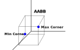

# Chapter 18 - 3D Object Picking

One of the key aspects of every game is the ability to interact with the environment. This capability requires to be able to select objects in the 3D scene. In this chapter we will explore how this can be achieved.

You can find the complete source code for this chapter [here](https://github.com/lwjglgamedev/lwjglbook/tree/main/chapter-18).

## Concepts

We will add the capability to select entities by clicking the mouse on the screen. In order to do so, we will cast a ray from the camera position (our origin) using as a direction the point where we have clicked with the mouse (transforming from mouse coordinates to world coordinates). With that ray we will check if it intersects with bounding boxes associate to each entity (that is a cube that encloses the model associated to an entity).


We need to implement the follow steps:

* Associate a bounding box to each model (to each mesh of the model indeed).
* Transform mouse coordinates to world space ones to cast a ray from the camera position.
* For each entity, iterate over the associated meshes and check if we intersect with the ray.
* We will select the entity which intersects with the closest distance to the ray.
* If we have a selected entity we will highlight it in the fragment shader.

## Code preparation

We will start first by calculating the bounding box for each mesh of the models we load. We will let [assimp](https://github.com/assimp/assimp) do this work for us by adding an additional flag when loading the models: `aiProcess_GenBoundingBoxes`. This flag will automatically calculate a bounding box for each mex. That box will embed all the meshes and will be axis aligned. You may see the acronym "AABB" used for this, which means Axis Aligned Bounding Box. Why axis aligned boxes ? Because it will simplify intersection calculations a lot. By using that flag, [assimp](https://github.com/assimp/assimp) will perform those calculations which will be available as the corners of the bounding box (with minimum and maximum coordinates). The following figure shows how it would look like for a cube.



Once enabled the calculation, we need to retrieve that information when processing the meshes:

```java
public class ModelLoader {
    ...
    public static Model loadModel(String modelId, String modelPath, TextureCache textureCache, boolean animation) {
        return loadModel(modelId, modelPath, textureCache, aiProcess_GenSmoothNormals | aiProcess_JoinIdenticalVertices |
                aiProcess_Triangulate | aiProcess_FixInfacingNormals | aiProcess_CalcTangentSpace | aiProcess_LimitBoneWeights |
                aiProcess_GenBoundingBoxes | (animation ? 0 : aiProcess_PreTransformVertices));

    }
    ...
    private static Mesh processMesh(AIMesh aiMesh, List<Bone> boneList) {
        ...
        AIAABB aabb = aiMesh.mAABB();
        Vector3f aabbMin = new Vector3f(aabb.mMin().x(), aabb.mMin().y(), aabb.mMin().z());
        Vector3f aabbMax = new Vector3f(aabb.mMax().x(), aabb.mMax().y(), aabb.mMax().z());

        return new Mesh(vertices, normals, tangents, bitangents, textCoords, indices, animMeshData.boneIds,
                animMeshData.weights, aabbMin, aabbMax);
    }
    ...
}
```

We need to store that information in the `Mesh` class:

```java
public class Mesh {
    ...
    private Vector3f aabbMax;
    private Vector3f aabbMin;
    ...
    public Mesh(float[] positions, float[] normals, float[] tangents, float[] bitangents, float[] textCoords, int[] indices) {
        this(positions, normals, tangents, bitangents, textCoords, indices,
                new int[Mesh.MAX_WEIGHTS * positions.length / 3], new float[Mesh.MAX_WEIGHTS * positions.length / 3],
                new Vector3f(), new Vector3f());
    }

    public Mesh(float[] positions, float[] normals, float[] tangents, float[] bitangents, float[] textCoords, int[] indices,
                int[] boneIndices, float[] weights, Vector3f aabbMin, Vector3f aabbMax) {
        this.aabbMin = aabbMin;
        this.aabbMax = aabbMax;
        ...
    }
    ...
    public Vector3f getAabbMax() {
        return aabbMax;
    }

    public Vector3f getAabbMin() {
        return aabbMin;
    }
    ...
}
```

While performing the ray intersection calculations we will need inverse view and projection matrices in order to transform from screen space to world space coordinates. Therefore, we will modify the `Camera` and `Projection` class to automatically calculate the inverse of their respective matrices whenever they are updated:

```java
public class Camera {
    ...
    private Matrix4f invViewMatrix;
    ...
    public Camera() {
        ...
        invViewMatrix = new Matrix4f();
        ...
    }
    ...
    public Matrix4f getInvViewMatrix() {
        return invViewMatrix;
    }
    ...
    private void recalculate() {
        viewMatrix.identity()
                .rotateX(rotation.x)
                .rotateY(rotation.y)
                .translate(-position.x, -position.y, -position.z);
        invViewMatrix.set(viewMatrix).invert();
    }
    ...
}
```

```java
public class Projection {
    ...
    private Matrix4f invProjMatrix;
    ...
    public Projection(int width, int height) {
        ...
        invProjMatrix = new Matrix4f();
        ...
    }

    public Matrix4f getInvProjMatrix() {
        return invProjMatrix;
    }
    ...
    public void updateProjMatrix(int width, int height) {
        projMatrix.setPerspective(FOV, (float) width / height, Z_NEAR, Z_FAR);
        invProjMatrix.set(projMatrix).invert();
    }
}
```

We will need also to store the selected `Entity` once we have done the calculations, we will do this in the `Scene` class:

```java
public class Scene {
    ...
    private Entity selectedEntity;
    ...
    public Entity getSelectedEntity() {
        return selectedEntity;
    }
    ...
    public void setSelectedEntity(Entity selectedEntity) {
        this.selectedEntity = selectedEntity;
    }
    ...
}
```

Finally, we will create a new uniform while rendering the scene that will be activated if we are rendering an `Entity` that is selected:

```java
public class SceneRender {
    ...
    private void createUniforms() {
        ...
        uniformsMap.createUniform("selected");
    }

    public void render(Scene scene, ShadowRender shadowRender) {
        ...
        Entity selectedEntity = scene.getSelectedEntity();
        for (Model model : models) {
            List<Entity> entities = model.getEntitiesList();

            for (Material material : model.getMaterialList()) {
                ...
                for (Mesh mesh : material.getMeshList()) {
                    glBindVertexArray(mesh.getVaoId());
                    for (Entity entity : entities) {
                        uniformsMap.setUniform("selected",
                                selectedEntity != null && selectedEntity.getId().equals(entity.getId()) ? 1 : 0);
                        ...
                    }
                    ...
                }
                ...
            }
        }
        ...
    }
    ...
}
```

In the fragment shader (`scene.frag`), we will just modify the blue component of the fragment that belongs to a selected entity:

```glsl
#version 330
...
uniform int selected;
...
void main() {
    ...
    if (selected > 0) {
        fragColor = vec4(fragColor.x, fragColor.y, 1, 1);
    }
}
```

## Entity selection

We can now proceed with the code for determining if an `Entity` must be selected. In the `Main` class, in the `input` method, we will check if the mouse left button has been pressed. If so, we will invoke a new method (`selectEntity`) where will be doing the calculations:

```java
public class Main implements IAppLogic {
    ...
    public void input(Window window, Scene scene, long diffTimeMillis, boolean inputConsumed) {
        ...
        if (mouseInput.isLeftButtonPressed()) {
            selectEntity(window, scene, mouseInput.getCurrentPos());
        }
        ...
    }
    ...
}
```

The `selectEntity` method starts like this:

```java
public class Main implements IAppLogic {
    ...
    private void selectEntity(Window window, Scene scene, Vector2f mousePos) {
        int wdwWidth = window.getWidth();
        int wdwHeight = window.getHeight();

        float x = (2 * mousePos.x) / wdwWidth - 1.0f;
        float y = 1.0f - (2 * mousePos.y) / wdwHeight;
        float z = -1.0f;

        Matrix4f invProjMatrix = scene.getProjection().getInvProjMatrix();
        Vector4f mouseDir = new Vector4f(x, y, z, 1.0f);
        mouseDir.mul(invProjMatrix);
        mouseDir.z = -1.0f;
        mouseDir.w = 0.0f;

        Matrix4f invViewMatrix = scene.getCamera().getInvViewMatrix();
        mouseDir.mul(invViewMatrix);
        ...
    }
    ...
}
```

We need to calculate that direction vector using the click coordinates. But, how do we pass from a $$(x,y)$$ coordinates in viewport space to world space? Let’s review how we pass from model space coordinates to view space. The different coordinate transformations that are applied in order to achieve that are:

* We pass from model coordinates to world coordinates using the model matrix.
* We pass from world coordinates to view space coordinates using the view matrix (that provides the camera effect)-
* We pass from view coordinates to homogeneous clip space by applying the perspective projection matrix.
* Final screen coordinates are calculate automatically by OpenGL for us. Before doing that, it passes to normalized device space (by dividing the $$x, y,z$$ coordinates by the $$w$$ component) and then to $$x,y$$ screen coordinates.

So we need just to perform the traverse the inverse path to get from screen coordinates $$(x,y)$$, to world coordinates.

The first step is to transform from screen coordinates to normalized device space. The $$(x, y)$$ coordinates in the view port space are in the range $$[0, screen width]$$ $$[0, screen height]$$. The upper left corner of the screen has a coordinate of $$(0, 0)$$. We need to transform that into coordinates in the range $$[-1, 1]$$.

.png>)

The maths are simple:

$$x = 2 \cdot screen_x / screenwidth - 1$$

$$y = 1 - 2 * screen_y / screenheight$$

But, how do we calculate the $$z$$ component? The answer is simple, we simply assign it the $$-1$$ value, so that the ray points to the farthest visible distance (Remember that in OpenGL, $$-1$$ points to the screen). Now we have the coordinates in normalized device space.

In order to continue with the transformations we need to convert them to the homogeneous clip space. We need to have the $$w$$ component, that is use homogeneous coordinates. Although this concept was presented in the previous chapters, let’s get back to it. In order to represent a 3D point we just need the $$x$$, $$y$$ and $$z$$ components, but we are continuously working with an additional component, the $$w$$ component. We need this extra component in order to use matrices to perform the different transformations. Some transformations do not need that extra component but other do. For instance, the translation matrix does not work if we only have $$x$$, $$y$$ and $$z$$ components. Thus, we have added the w component and assigned them a value of $$1$$ so we can work with 4 by 4 matrices.

Besides that, most of transformations, or to be more precise, most of the transformation matrices do not alter the $$w$$ component. An exception to this is the projection matrix. This matrix changes the $$w$$ value to be proportional to the $$z$$ component.

Transforming from homogeneous clip space to normalized device coordinates is achieved by dividing the $$x$$, $$y$$ and $$z$$ components by $$w$$. As this component is proportional to the z component, this implies that distant objects are drawn smaller. In our case we need to do the reverse, we need to unproject, but since what we are calculating is a ray we just simply can ignore that step, set the $$w$$ component to $$1$$ and leave the rest of the components at their original value.

Now we need to go back to view space. This is easy, we just need to calculate the inverse of the projection matrix and multiply it by our 4 components vector. Once we have done that, we need to transform them to world space. Again, we just need to use the view matrix, calculate its inverse and multiply it by our vector.

Remember that we are only interested in directions, so, in this case we set the $$w$$ component to $$0$$. Also we can set the $$z$$ component again to $$-1$$, since we want it to point towards the screen. Once we have done that and applied the inverse view matrix we have our vector in world space.

The next step is to iterate over entities with their associated meshes and check if their bounding boxes intersect with the ray which starts at the camera position:

```java
public class Main implements IAppLogic {
    ...
    private void selectEntity(Window window, Scene scene, Vector2f mousePos) {
        ...
        Vector4f min = new Vector4f(0.0f, 0.0f, 0.0f, 1.0f);
        Vector4f max = new Vector4f(0.0f, 0.0f, 0.0f, 1.0f);
        Vector2f nearFar = new Vector2f();

        Entity selectedEntity = null;
        float closestDistance = Float.POSITIVE_INFINITY;
        Vector3f center = scene.getCamera().getPosition();

        Collection<Model> models = scene.getModelMap().values();
        Matrix4f modelMatrix = new Matrix4f();
        for (Model model : models) {
            List<Entity> entities = model.getEntitiesList();
            for (Entity entity : entities) {
                modelMatrix.translate(entity.getPosition()).scale(entity.getScale());
                for (Material material : model.getMaterialList()) {
                    for (Mesh mesh : material.getMeshList()) {
                        Vector3f aabbMin = mesh.getAabbMin();
                        min.set(aabbMin.x, aabbMin.y, aabbMin.z, 1.0f);
                        min.mul(modelMatrix);
                        Vector3f aabMax = mesh.getAabbMax();
                        max.set(aabMax.x, aabMax.y, aabMax.z, 1.0f);
                        max.mul(modelMatrix);
                        if (Intersectionf.intersectRayAab(center.x, center.y, center.z, mouseDir.x, mouseDir.y, mouseDir.z,
                                min.x, min.y, min.z, max.x, max.y, max.z, nearFar) && nearFar.x < closestDistance) {
                            closestDistance = nearFar.x;
                            selectedEntity = entity;
                        }
                    }
                }
                modelMatrix.identity();
            }
        }

        scene.setSelectedEntity(selectedEntity);
    }
    ...
}
```

We define a variable named `closestDistance`. This variable will hold the closest distance. For game items that intersect, the distance from the camera to the intersection point will be calculated, If it’s lower than the value stored in `closestDistance`, then this item will be the new candidate. We need to translate and scale the bounding box of eah mesh. We cannot use the model matrix a sit is as it will take into consideration also the rotation (we do not want that since we want the box to be axis aligned). This is why we just apply translation and scaling using entity's data to construct a model matrix. But, how do we calculate the intersection? This is where the glorious [JOML](https://github.com/JOML-CI/JOML) library comes to the rescue. We are using [JOML](https://github.com/JOML-CI/JOML)’s `Intersectionf` class, which provides several methods to calculate intersections in 2D and 3D. Specifically, we are using the `intersectRayAab` method.

This method implements the algorithm that test intersection for Axis Aligned Boxes. You can check the details, as pointed out in the JOML documentation, [here](http://people.csail.mit.edu/amy/papers/box-jgt.pdf).

The method tests if a ray, defined by an origin and a direction, intersects a box, defined by minimum and maximum corner. As it has been said beforeThis algorithm is valid, because our cubes, are aligned with the axis, if they were rotated, this method would not work. In addition to that, when having animations you may need to have different bounding boxes per animation frame (assimp calculates the bounding box for the binding pose). The `intersectRayAab` method receives the following parameters:

* An origin: In our case, this will be our camera position.
* A direction: This is the ray that points to the mouse coordinates (world space).
* The minimum corner of the box.
* The maximum corner. Self explanatory.
* A result vector. This will contain the near and far distances of the intersection points.

The method will return true if there is an intersection. If true, we check the closes distance and update it if needed, and store a reference of the candidate selected.

Obviously, the method presented here is far from optimal but it will give you the basics to develop more sophisticated methods on your own. Some parts of the scene could be easily discarded, like objects behind the camera, since they are not going to be intersected. Besides that, you may want to order your items according to the distance to the camera to speed up calculations.

We will modify the `Main` class to show two spinning cubes to illustrate the technique:

```java
public class Main implements IAppLogic {
    ...
    private Entity cubeEntity1;
    private Entity cubeEntity2;
    ...
    private float rotation;

    public static void main(String[] args) {
        ...
        Engine gameEng = new Engine("chapter-18", opts, main);
        ...
    }
    ...
    public void init(Window window, Scene scene, Render render) {
        ...
        Model cubeModel = ModelLoader.loadModel("cube-model", "resources/models/cube/cube.obj",
                scene.getTextureCache(), false);
        scene.addModel(cubeModel);
        cubeEntity1 = new Entity("cube-entity-1", cubeModel.getId());
        cubeEntity1.setPosition(0, 2, -1);
        scene.addEntity(cubeEntity1);

        cubeEntity2 = new Entity("cube-entity-2", cubeModel.getId());
        cubeEntity2.setPosition(-2, 2, -1);
        scene.addEntity(cubeEntity2);
        ...
    }
    ...
    public void update(Window window, Scene scene, long diffTimeMillis) {
        rotation += 1.5;
        if (rotation > 360) {
            rotation = 0;
        }
        cubeEntity1.setRotation(1, 1, 1, (float) Math.toRadians(rotation));
        cubeEntity1.updateModelMatrix();

        cubeEntity2.setRotation(1, 1, 1, (float) Math.toRadians(360 - rotation));
        cubeEntity2.updateModelMatrix();
    }
}
```

You will be able to see how cubes are rendered in blue when licked with the mouse:

.png>)

[Next chapter](../chapter-19/chapter-19.md)
