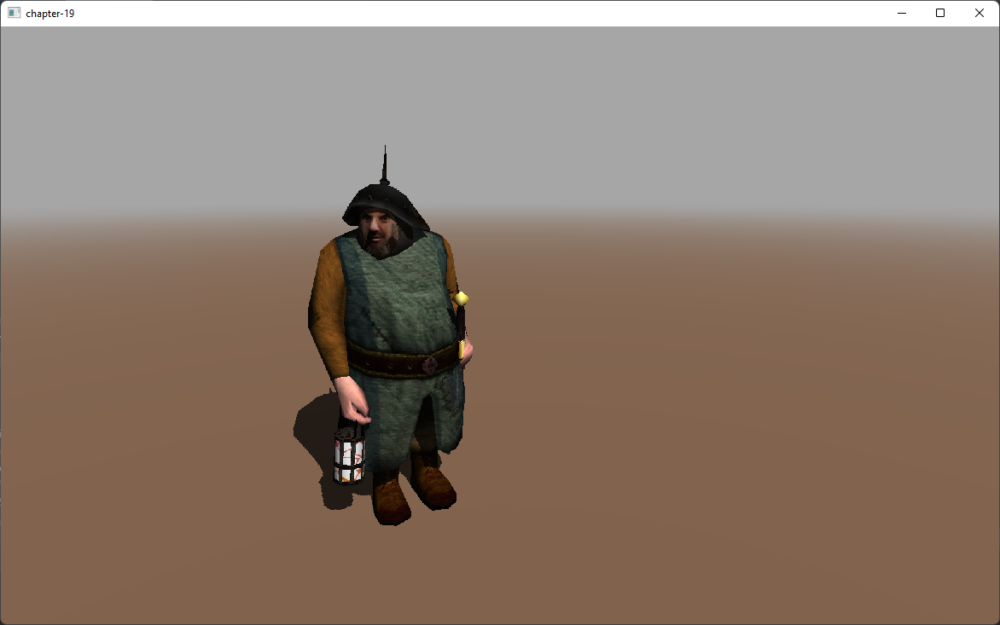

# Chapter 19 - Deferred Shading

Up to now the way that we are rendering a 3D scene is called forward rendering. We first render the 3D objects and apply the texture and lighting effects in a fragment shader. This method is not very efficient if we have a complex fragment shader pass with many lights and complex effects. In addition to that we may end up applying these effects to fragments that may be later on discarded due to depth testing \(although this is not exactly true if we enable [early fragment testing](https://www.khronos.org/opengl/wiki/Early_Fragment_Test)\).

In order to alleviate the problems described above we may change the way that we render the scene by using a technical called deferred shading. With deferred shading we first render the geometry information that is required in later stages \(in the fragment shader\) to a buffer. The complex calculus required by the fragment shader are postponed, deferred, to a later stage when using the information stored in those buffers.

You can find the complete source code for this chapter [here](https://github.com/lwjglgamedev/lwjglbook/tree/main/chapter-19).

## Concepts

Deferred requires to perform two rendering passes. The first one, is the geometry pass, where we render the scene to a buffer that will contain the following information:

* Depth value.
* The diffuse colors and reflectance factor for each position.
* The specular component for each position.
* The normals at each position \(also in light view coordinate system\).

All that information is stored in a buffer called G-Buffer.

The second pass is called the lighting pass. This pass takes a quad that fills up all the screen and generates the color information for each fragment using the information contained in the G-Buffer. When we will be performing the lighting pass, the depth test will have already removed all the scene data that would not be seen. Hence, the number of operations to be done are restricted to what will be displayed on the screen.

You may be asking if performing additional rendering passes will result in an increase of performance or not. The answer is that it depends. Deferred shading is usually used when you have many different light passes. In this case, the additional rendering steps are compensated by the reduction of operations that will be done in the fragment shader.

## G-Buffer

So let’s start coding. The first task that we will be doing is create a new class for the G-Buffer. The class, named `GBuffer`, is defined like this:

```java
package org.lwjglb.engine.graph;

import org.lwjgl.opengl.GL30;
import org.lwjgl.system.MemoryStack;
import org.lwjglb.engine.Window;

import java.nio.*;
import java.util.Arrays;

import static org.lwjgl.opengl.GL30.*;

public class GBuffer {

    private static final int TOTAL_TEXTURES = 4;

    private int gBufferId;
    private int height;
    private int[] textureIds;
    private int width;
    ...
}
```

The class defines a constant that models the maximum number of buffers to be used. The identifier associated to the G-Buffer itself and an array for the individual buffers. The size of the textures is also stored.

Let’s review the constructor:

```java
public class GBuffer {
    ...
    public GBuffer(Window window) {
        gBufferId = glGenFramebuffers();
        glBindFramebuffer(GL_DRAW_FRAMEBUFFER, gBufferId);

        textureIds = new int[TOTAL_TEXTURES];
        glGenTextures(textureIds);

        this.width = window.getWidth();
        this.height = window.getHeight();

        for (int i = 0; i < TOTAL_TEXTURES; i++) {
            glBindTexture(GL_TEXTURE_2D, textureIds[i]);
            int attachmentType;
            if (i == TOTAL_TEXTURES - 1) {
                glTexImage2D(GL_TEXTURE_2D, 0, GL_DEPTH_COMPONENT32F, width, height, 0, GL_DEPTH_COMPONENT, GL_FLOAT,
                        (ByteBuffer) null);
                attachmentType = GL_DEPTH_ATTACHMENT;
            } else {
                glTexImage2D(GL_TEXTURE_2D, 0, GL_RGBA32F, width, height, 0, GL_RGBA, GL_FLOAT, (ByteBuffer) null);
                attachmentType = GL_COLOR_ATTACHMENT0 + i;
            }
            glTexParameterf(GL_TEXTURE_2D, GL_TEXTURE_MIN_FILTER, GL_NEAREST);
            glTexParameterf(GL_TEXTURE_2D, GL_TEXTURE_MAG_FILTER, GL_NEAREST);

            glFramebufferTexture2D(GL_FRAMEBUFFER, attachmentType, GL_TEXTURE_2D, textureIds[i], 0);
        }

        try (MemoryStack stack = MemoryStack.stackPush()) {
            IntBuffer intBuff = stack.mallocInt(TOTAL_TEXTURES);
            for (int i = 0; i < TOTAL_TEXTURES; i++) {
                intBuff.put(i, GL_COLOR_ATTACHMENT0 + i);
            }
            glDrawBuffers(intBuff);
        }

        glBindFramebuffer(GL_FRAMEBUFFER, 0);
    }
    ...
}
```

The first thing that we do is create a frame buffer. Remember that a frame buffer is just an OpenGL objects that can be used to render operations instead of rendering to the screen. Then we generate a set of textures \(4 textures\), that will be associated to the frame buffer.

After that, we use a for loop to initialize the textures. We have the following types:

* “Regular textures”, that will store positions, normals, the diffuse component, etc.
* A texture for storing the depth buffer. This will be our last texture.

Once the texture has been initialized, we enable sampling for them and attach them to the frame buffer. Each texture is attached using an identifier which starts at `GL_COLOR_ATTACHMENT0`. Each texture increments by one that id, so the positions are attached using `GL_COLOR_ATTACHMENT0`, the diffuse component uses `GL_COLOR_ATTACHMENT1` \(which is `GL_COLOR_ATTACHMENT0 + 1`\), and so on.

After all the textures have been created, we need to enable them to be used by the fragment shader for rendering. This is done with the `glDrawBuffers` call. We just pass the array with the identifiers of the color attachments used \(`GL_COLOR_ATTACHMENT0` to `GL_COLOR_ATTACHMENT5`\).

The rest of the class are just getter methods and the cleanup one.

```java
public class GBuffer {
    ...
    public void cleanUp() {
        glDeleteFramebuffers(gBufferId);
        Arrays.stream(textureIds).forEach(GL30::glDeleteTextures);
    }

    public int getGBufferId() {
        return gBufferId;
    }

    public int getHeight() {
        return height;
    }

    public int[] getTextureIds() {
        return textureIds;
    }

    public int getWidth() {
        return width;
    }
}
```

## Geometry pass

Let's examine the changes that we need to apply when doing the geometry pass. We will apply these changes to the `SceneRender` class and the associated shaders. Staring with the `SceneRender` class, we need to remove light constants and light uniforms, they will note be used in this pass (we will also not be using ambient color for materials to simplify, we need to remove also that uniform and will remove also the selected entity uniform):

```java
public class SceneRender {

    private ShaderProgram shaderProgram;
    private UniformsMap uniformsMap;
    ...
    private void createUniforms() {
        uniformsMap = new UniformsMap(shaderProgram.getProgramId());
        uniformsMap.createUniform("projectionMatrix");
        uniformsMap.createUniform("modelMatrix");
        uniformsMap.createUniform("viewMatrix");
        uniformsMap.createUniform("bonesMatrices");
        uniformsMap.createUniform("txtSampler");
        uniformsMap.createUniform("normalSampler");
        uniformsMap.createUniform("material.diffuse");
        uniformsMap.createUniform("material.specular");
        uniformsMap.createUniform("material.reflectance");
        uniformsMap.createUniform("material.hasNormalMap");
    }
    ...
}
```

The `render` method is defined like this:

```java
public class SceneRender {
    ...
    public void render(Scene scene, GBuffer gBuffer) {
        glBindFramebuffer(GL_DRAW_FRAMEBUFFER, gBuffer.getGBufferId());
        glClear(GL_COLOR_BUFFER_BIT | GL_DEPTH_BUFFER_BIT);
        glViewport(0, 0, gBuffer.getWidth(), gBuffer.getHeight());
        glDisable(GL_BLEND);

        shaderProgram.bind();

        uniformsMap.setUniform("projectionMatrix", scene.getProjection().getProjMatrix());
        uniformsMap.setUniform("viewMatrix", scene.getCamera().getViewMatrix());

        uniformsMap.setUniform("txtSampler", 0);
        uniformsMap.setUniform("normalSampler", 1);

        Collection<Model> models = scene.getModelMap().values();
        TextureCache textureCache = scene.getTextureCache();
        for (Model model : models) {
            List<Entity> entities = model.getEntitiesList();

            for (Material material : model.getMaterialList()) {
                uniformsMap.setUniform("material.diffuse", material.getDiffuseColor());
                uniformsMap.setUniform("material.specular", material.getSpecularColor());
                uniformsMap.setUniform("material.reflectance", material.getReflectance());
                String normalMapPath = material.getNormalMapPath();
                boolean hasNormalMapPath = normalMapPath != null;
                uniformsMap.setUniform("material.hasNormalMap", hasNormalMapPath ? 1 : 0);
                Texture texture = textureCache.getTexture(material.getTexturePath());
                glActiveTexture(GL_TEXTURE0);
                texture.bind();
                if (hasNormalMapPath) {
                    Texture normalMapTexture = textureCache.getTexture(normalMapPath);
                    glActiveTexture(GL_TEXTURE1);
                    normalMapTexture.bind();
                }

                for (Mesh mesh : material.getMeshList()) {
                    glBindVertexArray(mesh.getVaoId());
                    for (Entity entity : entities) {
                        uniformsMap.setUniform("modelMatrix", entity.getModelMatrix());
                        AnimationData animationData = entity.getAnimationData();
                        if (animationData == null) {
                            uniformsMap.setUniform("bonesMatrices", AnimationData.DEFAULT_BONES_MATRICES);
                        } else {
                            uniformsMap.setUniform("bonesMatrices", animationData.getCurrentFrame().boneMatrices());
                        }
                        glDrawElements(GL_TRIANGLES, mesh.getNumVertices(), GL_UNSIGNED_INT, 0);
                    }
                }
            }
        }

        glBindVertexArray(0);
        glEnable(GL_BLEND);
        shaderProgram.unbind();
    }
}
```

You can see that we receive now a `GBuffer` instance as a method parameter. That buffer is where we will perform the rendering, therefore we first bind that buffer by calling the `glBindFramebuffer` . After that, we clear that buffer and disable blending. When using deferred rendering, transparent objects are a bit tricky. The approach would be to render them in light pass or to discard them in the geometry pass. As you can see we have removed all the lights uniform set up code.

The ony change in the vertex shader (`scene.vert`) is that now the view position is a four components vector (`vec4`):

```glsl
#version 330
...
out vec4 outViewPosition;
...
void main()
{
    ...
    outWorldPosition = modelMatrix * initPos;
    outViewPosition  = viewMatrix * outWorldPosition;
    gl_Position   = projectionMatrix * outViewPosition;
    outNormal     = normalize(modelViewMatrix * initNormal).xyz;
    outTangent    = normalize(modelViewMatrix * initTangent).xyz;
    outBitangent  = normalize(modelViewMatrix * initBitangent).xyz;
    outTextCoord  = texCoord;
}
```

The fragment shader (`scene.frag`) has been simplified a lot:

```glsl
#version 330

in vec3 outNormal;
in vec3 outTangent;
in vec3 outBitangent;
in vec2 outTextCoord;
in vec4 outViewPosition;
in vec4 outWorldPosition;

layout (location = 0) out vec4 buffAlbedo;
layout (location = 1) out vec4 buffNormal;
layout (location = 2) out vec4 buffSpecular;

struct Material
{
    vec4 diffuse;
    vec4 specular;
    float reflectance;
    int hasNormalMap;
};

uniform sampler2D txtSampler;
uniform sampler2D normalSampler;
uniform Material material;

vec3 calcNormal(vec3 normal, vec3 tangent, vec3 bitangent, vec2 textCoords) {
    mat3 TBN = mat3(tangent, bitangent, normal);
    vec3 newNormal = texture(normalSampler, textCoords).rgb;
    newNormal = normalize(newNormal * 2.0 - 1.0);
    newNormal = normalize(TBN * newNormal);
    return newNormal;
}

void main() {
    vec4 text_color = texture(txtSampler, outTextCoord);
    vec4 diffuse = text_color + material.diffuse;
    if (diffuse.a < 0.5) {
        discard;
    }
    vec4 specular = text_color + material.specular;

    vec3 normal = outNormal;
    if (material.hasNormalMap > 0) {
        normal = calcNormal(outNormal, outTangent, outBitangent, outTextCoord);
    }

    buffAlbedo   = vec4(diffuse.xyz, material.reflectance);
    buffNormal   = vec4(0.5 * normal + 0.5, 1.0);
    buffSpecular = specular;
}
```

The most relevant lines are:

```glsl
...
layout (location = 0) out vec4 buffAlbedo;
layout (location = 1) out vec4 buffNormal;
layout (location = 2) out vec4 buffSpecular;
...
```

This is where we are referring to the textures that this fragment shader will write to. As you can see we just dump  the diffuse color \(which can be the color of the associated texture of a component of the material\), the specular component, the normal, and the depth values for the shadow map. You may notice that we do not store the position in the textures, this is because we can reconstruct fragment position using depth values. We will sww how this can be done in the lighting pass.

SIDE NOTE: We have simplified the `Material` class definition removing the ambient color component.

If you debug the sample execution with an OpenGL debugger \(such as RenderDoc\), you can view the textures generated during the geometry pass. The albedo texture will look like this:


The texture that holds the values for the normals will look like this:


The texture that holds the values for the specular colors will look like this:


And finally, the depth texture will look like this:


## Lighting pass

In order to perform the lighting pass, we will create a new class named `LightsRender` which starts like this:

```java
package org.lwjglb.engine.graph;

import org.joml.*;
import org.lwjglb.engine.scene.*;
import org.lwjglb.engine.scene.lights.*;

import java.util.*;

import static org.lwjgl.opengl.GL11.*;
import static org.lwjgl.opengl.GL14.*;
import static org.lwjgl.opengl.GL30.*;

public class LightsRender {
    private static final int MAX_POINT_LIGHTS = 5;
    private static final int MAX_SPOT_LIGHTS = 5;

    private final ShaderProgram shaderProgram;

    private QuadMesh quadMesh;
    private UniformsMap uniformsMap;

    public LightsRender() {
        List<ShaderProgram.ShaderModuleData> shaderModuleDataList = new ArrayList<>();
        shaderModuleDataList.add(new ShaderProgram.ShaderModuleData("resources/shaders/lights.vert", GL_VERTEX_SHADER));
        shaderModuleDataList.add(new ShaderProgram.ShaderModuleData("resources/shaders/lights.frag", GL_FRAGMENT_SHADER));
        shaderProgram = new ShaderProgram(shaderModuleDataList);
        quadMesh = new QuadMesh();
        createUniforms();
    }

    public void cleanup() {
        quadMesh.cleanup();
        shaderProgram.cleanup();
    }
    ...
}
```

You can see that, in addition to create a new shader program, we define a new attribute of the `QadMesh` class (which has not been defined yet). Before analyzing the render method, let’s think a little bit about how we will render the lights. We need to use the contents of the G-Buffer, but in order to use them, we need to first render something. But, we have already drawn the scene, what are we going to render. now? The answer is simple, we just need to render a quad that fills all the screen. For each fragment of that quad, we will use the data contained in the G-Buffer and generate the correct output color. This where the `QuadMesh` class comes to play, it just defines a quad which will be used to render in the lighting pass and is defined like this:


```java
package org.lwjglb.engine.graph;

import org.lwjgl.opengl.GL30;
import org.lwjgl.system.*;

import java.nio.*;
import java.util.*;

import static org.lwjgl.opengl.GL30.*;

public class QuadMesh {

    private int numVertices;
    private int vaoId;
    private List<Integer> vboIdList;

    public QuadMesh() {
        try (MemoryStack stack = MemoryStack.stackPush()) {
            vboIdList = new ArrayList<>();
            float[] positions = new float[]{
                    -1.0f, 1.0f, 0.0f,
                    1.0f, 1.0f, 0.0f,
                    -1.0f, -1.0f, 0.0f,
                    1.0f, -1.0f, 0.0f,};
            float[] textCoords = new float[]{
                    0.0f, 1.0f,
                    1.0f, 1.0f,
                    0.0f, 0.0f,
                    1.0f, 0.0f,};
            int[] indices = new int[]{0, 2, 1, 1, 2, 3};
            numVertices = indices.length;

            vaoId = glGenVertexArrays();
            glBindVertexArray(vaoId);

            // Positions VBO
            int vboId = glGenBuffers();
            vboIdList.add(vboId);
            FloatBuffer positionsBuffer = stack.callocFloat(positions.length);
            positionsBuffer.put(0, positions);
            glBindBuffer(GL_ARRAY_BUFFER, vboId);
            glBufferData(GL_ARRAY_BUFFER, positionsBuffer, GL_STATIC_DRAW);
            glEnableVertexAttribArray(0);
            glVertexAttribPointer(0, 3, GL_FLOAT, false, 0, 0);

            // Texture coordinates VBO
            vboId = glGenBuffers();
            vboIdList.add(vboId);
            FloatBuffer textCoordsBuffer = MemoryUtil.memAllocFloat(textCoords.length);
            textCoordsBuffer.put(0, textCoords);
            glBindBuffer(GL_ARRAY_BUFFER, vboId);
            glBufferData(GL_ARRAY_BUFFER, textCoordsBuffer, GL_STATIC_DRAW);
            glEnableVertexAttribArray(1);
            glVertexAttribPointer(1, 2, GL_FLOAT, false, 0, 0);

            // Index VBO
            vboId = glGenBuffers();
            vboIdList.add(vboId);
            IntBuffer indicesBuffer = stack.callocInt(indices.length);
            indicesBuffer.put(0, indices);
            glBindBuffer(GL_ELEMENT_ARRAY_BUFFER, vboId);
            glBufferData(GL_ELEMENT_ARRAY_BUFFER, indicesBuffer, GL_STATIC_DRAW);

            glBindBuffer(GL_ARRAY_BUFFER, 0);
            glBindVertexArray(0);
        }
    }

    public void cleanup() {
        vboIdList.stream().forEach(GL30::glDeleteBuffers);
        glDeleteVertexArrays(vaoId);
    }

    public int getNumVertices() {
        return numVertices;
    }

    public int getVaoId() {
        return vaoId;
    }
}
```

As you can see we just need position and texture coordinate attributes (to properly access G-Buffer textures). Going back to the `LightsRender` class, we need a method to create the uniforms, which as uou will see, restores the light uniforms previously used in the `SceneRender`class plus a set of new ones to map G-Buffer textures (`albedoSampler`, `normalSampler`, `specularSampler` and `depthSampler`). In addition to that, we will need new uniforms to calculate fragment position form depth values such as `invProjectionMatrix` and `invViewMatrix`. We will see in the shaders code how they will be used.

```java
public class LightsRender {
    ...
    private void createUniforms() {
        uniformsMap = new UniformsMap(shaderProgram.getProgramId());
        uniformsMap.createUniform("albedoSampler");
        uniformsMap.createUniform("normalSampler");
        uniformsMap.createUniform("specularSampler");
        uniformsMap.createUniform("depthSampler");
        uniformsMap.createUniform("invProjectionMatrix");
        uniformsMap.createUniform("invViewMatrix");
        uniformsMap.createUniform("ambientLight.factor");
        uniformsMap.createUniform("ambientLight.color");

        for (int i = 0; i < MAX_POINT_LIGHTS; i++) {
            String name = "pointLights[" + i + "]";
            uniformsMap.createUniform(name + ".position");
            uniformsMap.createUniform(name + ".color");
            uniformsMap.createUniform(name + ".intensity");
            uniformsMap.createUniform(name + ".att.constant");
            uniformsMap.createUniform(name + ".att.linear");
            uniformsMap.createUniform(name + ".att.exponent");
        }
        for (int i = 0; i < MAX_SPOT_LIGHTS; i++) {
            String name = "spotLights[" + i + "]";
            uniformsMap.createUniform(name + ".pl.position");
            uniformsMap.createUniform(name + ".pl.color");
            uniformsMap.createUniform(name + ".pl.intensity");
            uniformsMap.createUniform(name + ".pl.att.constant");
            uniformsMap.createUniform(name + ".pl.att.linear");
            uniformsMap.createUniform(name + ".pl.att.exponent");
            uniformsMap.createUniform(name + ".conedir");
            uniformsMap.createUniform(name + ".cutoff");
        }

        uniformsMap.createUniform("dirLight.color");
        uniformsMap.createUniform("dirLight.direction");
        uniformsMap.createUniform("dirLight.intensity");

        uniformsMap.createUniform("fog.activeFog");
        uniformsMap.createUniform("fog.color");
        uniformsMap.createUniform("fog.density");

        for (int i = 0; i < CascadeShadow.SHADOW_MAP_CASCADE_COUNT; i++) {
            uniformsMap.createUniform("shadowMap_" + i);
            uniformsMap.createUniform("cascadeshadows[" + i + "]" + ".projViewMatrix");
            uniformsMap.createUniform("cascadeshadows[" + i + "]" + ".splitDistance");
        }
    }
    ...
}
```

The `render` method is defined like this:

```java
public class LightsRender {
    ...
    public void render(Scene scene, ShadowRender shadowRender, GBuffer gBuffer) {
        shaderProgram.bind();

        updateLights(scene);

        // Bind the G-Buffer textures
        int[] textureIds = gBuffer.getTextureIds();
        int numTextures = textureIds != null ? textureIds.length : 0;
        for (int i = 0; i < numTextures; i++) {
            glActiveTexture(GL_TEXTURE0 + i);
            glBindTexture(GL_TEXTURE_2D, textureIds[i]);
        }

        uniformsMap.setUniform("albedoSampler", 0);
        uniformsMap.setUniform("normalSampler", 1);
        uniformsMap.setUniform("specularSampler", 2);
        uniformsMap.setUniform("depthSampler", 3);

        Fog fog = scene.getFog();
        uniformsMap.setUniform("fog.activeFog", fog.isActive() ? 1 : 0);
        uniformsMap.setUniform("fog.color", fog.getColor());
        uniformsMap.setUniform("fog.density", fog.getDensity());

        int start = 4;
        List<CascadeShadow> cascadeShadows = shadowRender.getCascadeShadows();
        for (int i = 0; i < CascadeShadow.SHADOW_MAP_CASCADE_COUNT; i++) {
            glActiveTexture(GL_TEXTURE0 + start + i);
            uniformsMap.setUniform("shadowMap_" + i, start + i);
            CascadeShadow cascadeShadow = cascadeShadows.get(i);
            uniformsMap.setUniform("cascadeshadows[" + i + "]" + ".projViewMatrix", cascadeShadow.getProjViewMatrix());
            uniformsMap.setUniform("cascadeshadows[" + i + "]" + ".splitDistance", cascadeShadow.getSplitDistance());
        }
        shadowRender.getShadowBuffer().bindTextures(GL_TEXTURE0 + start);

        uniformsMap.setUniform("invProjectionMatrix", scene.getProjection().getInvProjMatrix());
        uniformsMap.setUniform("invViewMatrix", scene.getCamera().getInvViewMatrix());

        glBindVertexArray(quadMesh.getVaoId());
        glDrawElements(GL_TRIANGLES, quadMesh.getNumVertices(), GL_UNSIGNED_INT, 0);

        shaderProgram.unbind();
    }
    ...
}
```

After updating lights we activate the textures that l hold the results of the geometry pass. After that, we set fog and cascade shadows uniforms and draw just a quad.

So, how the vertex shader for the light pass looks like (`lights.vert`)?

```glsl
#version 330

layout (location=0) in vec3 inPos;
layout (location=1) in vec2 inCoord;

out vec2 outTextCoord;

void main()
{
    outTextCoord = inCoord;
    gl_Position = vec4(inPos, 1.0f);
}
```

The code above just dumps the vertices directly and passes the texture coordinates to the fragment shader. The fragment shader (`lights.frag`) is defined like this:

```glsl
#version 330

const int MAX_POINT_LIGHTS = 5;
const int MAX_SPOT_LIGHTS = 5;
const float SPECULAR_POWER = 10;
const int NUM_CASCADES = 3;
const float BIAS = 0.0005;
const float SHADOW_FACTOR = 0.25;

in vec2 outTextCoord;
out vec4 fragColor;

struct Attenuation
{
    float constant;
    float linear;
    float exponent;
};
struct AmbientLight
{
    float factor;
    vec3 color;
};
struct PointLight {
    vec3 position;
    vec3 color;
    float intensity;
    Attenuation att;
};
struct SpotLight
{
    PointLight pl;
    vec3 conedir;
    float cutoff;
};
struct DirLight
{
    vec3 color;
    vec3 direction;
    float intensity;
};
struct Fog
{
    int activeFog;
    vec3 color;
    float density;
};
struct CascadeShadow {
    mat4 projViewMatrix;
    float splitDistance;
};

uniform sampler2D albedoSampler;
uniform sampler2D normalSampler;
uniform sampler2D specularSampler;
uniform sampler2D depthSampler;

uniform mat4 invProjectionMatrix;
uniform mat4 invViewMatrix;

uniform AmbientLight ambientLight;
uniform PointLight pointLights[MAX_POINT_LIGHTS];
uniform SpotLight spotLights[MAX_SPOT_LIGHTS];
uniform DirLight dirLight;
uniform Fog fog;
uniform CascadeShadow cascadeshadows[NUM_CASCADES];
uniform sampler2D shadowMap_0;
uniform sampler2D shadowMap_1;
uniform sampler2D shadowMap_2;

vec4 calcAmbient(AmbientLight ambientLight, vec4 ambient) {
    return vec4(ambientLight.factor * ambientLight.color, 1) * ambient;
}

vec4 calcLightColor(vec4 diffuse, vec4 specular, float reflectance, vec3 lightColor, float light_intensity, vec3 position, vec3 to_light_dir, vec3 normal) {
    vec4 diffuseColor = vec4(0, 0, 0, 1);
    vec4 specColor = vec4(0, 0, 0, 1);

    // Diffuse Light
    float diffuseFactor = max(dot(normal, to_light_dir), 0.0);
    diffuseColor = diffuse * vec4(lightColor, 1.0) * light_intensity * diffuseFactor;

    // Specular Light
    vec3 camera_direction = normalize(-position);
    vec3 from_light_dir = -to_light_dir;
    vec3 reflected_light = normalize(reflect(from_light_dir, normal));
    float specularFactor = max(dot(camera_direction, reflected_light), 0.0);
    specularFactor = pow(specularFactor, SPECULAR_POWER);
    specColor = specular * light_intensity  * specularFactor * reflectance * vec4(lightColor, 1.0);

    return (diffuseColor + specColor);
}

vec4 calcPointLight(vec4 diffuse, vec4 specular, float reflectance, PointLight light, vec3 position, vec3 normal) {
    vec3 light_direction = light.position - position;
    vec3 to_light_dir  = normalize(light_direction);
    vec4 light_color = calcLightColor(diffuse, specular, reflectance, light.color, light.intensity, position, to_light_dir, normal);

    // Apply Attenuation
    float distance = length(light_direction);
    float attenuationInv = light.att.constant + light.att.linear * distance +
    light.att.exponent * distance * distance;
    return light_color / attenuationInv;
}

vec4 calcSpotLight(vec4 diffuse, vec4 specular, float reflectance, SpotLight light, vec3 position, vec3 normal) {
    vec3 light_direction = light.pl.position - position;
    vec3 to_light_dir  = normalize(light_direction);
    vec3 from_light_dir  = -to_light_dir;
    float spot_alfa = dot(from_light_dir, normalize(light.conedir));

    vec4 color = vec4(0, 0, 0, 0);

    if (spot_alfa > light.cutoff)
    {
        color = calcPointLight(diffuse, specular, reflectance, light.pl, position, normal);
        color *= (1.0 - (1.0 - spot_alfa)/(1.0 - light.cutoff));
    }
    return color;
}

vec4 calcDirLight(vec4 diffuse, vec4 specular, float reflectance, DirLight light, vec3 position, vec3 normal) {
    return calcLightColor(diffuse, specular, reflectance, light.color, light.intensity, position, normalize(light.direction), normal);
}

vec4 calcFog(vec3 pos, vec4 color, Fog fog, vec3 ambientLight, DirLight dirLight) {
    vec3 fogColor = fog.color * (ambientLight + dirLight.color * dirLight.intensity);
    float distance = length(pos);
    float fogFactor = 1.0 / exp((distance * fog.density) * (distance * fog.density));
    fogFactor = clamp(fogFactor, 0.0, 1.0);

    vec3 resultColor = mix(fogColor, color.xyz, fogFactor);
    return vec4(resultColor.xyz, color.w);
}

float textureProj(vec4 shadowCoord, vec2 offset, int idx) {
    float shadow = 1.0;

    if (shadowCoord.z > -1.0 && shadowCoord.z < 1.0) {
        float dist = 0.0;
        if (idx == 0) {
            dist = texture(shadowMap_0, vec2(shadowCoord.xy + offset)).r;
        } else if (idx == 1) {
            dist = texture(shadowMap_1, vec2(shadowCoord.xy + offset)).r;
        } else {
            dist = texture(shadowMap_2, vec2(shadowCoord.xy + offset)).r;
        }
        if (shadowCoord.w > 0 && dist < shadowCoord.z - BIAS) {
            shadow = SHADOW_FACTOR;
        }
    }
    return shadow;
}

float calcShadow(vec4 worldPosition, int idx) {
    vec4 shadowMapPosition = cascadeshadows[idx].projViewMatrix * worldPosition;
    float shadow = 1.0;
    vec4 shadowCoord = (shadowMapPosition / shadowMapPosition.w) * 0.5 + 0.5;
    shadow = textureProj(shadowCoord, vec2(0, 0), idx);
    return shadow;
}

void main()
{
    vec4 albedoSamplerValue = texture(albedoSampler, outTextCoord);
    vec3 albedo  = albedoSamplerValue.rgb;
    vec4 diffuse = vec4(albedo, 1);

    float reflectance = albedoSamplerValue.a;
    vec3 normal = normalize(2.0 * texture(normalSampler, outTextCoord).rgb  - 1.0);
    vec4 specular = texture(specularSampler, outTextCoord);

    // Retrieve position from depth
    float depth = texture(depthSampler, outTextCoord).x * 2.0 - 1.0;
    if (depth == 1) {
        discard;
    }
    vec4 clip      = vec4(outTextCoord.x * 2.0 - 1.0, outTextCoord.y * 2.0 - 1.0, depth, 1.0);
    vec4 view_w    = invProjectionMatrix * clip;
    vec3 view_pos  = view_w.xyz / view_w.w;
    vec4 world_pos = invViewMatrix * vec4(view_pos, 1);

    vec4 diffuseSpecularComp = calcDirLight(diffuse, specular, reflectance, dirLight, view_pos, normal);

    int cascadeIndex;
    for (int i=0; i<NUM_CASCADES - 1; i++) {
        if (view_pos.z < cascadeshadows[i].splitDistance) {
            cascadeIndex = i + 1;
            break;
        }
    }
    float shadowFactor = calcShadow(world_pos, cascadeIndex);

    for (int i=0; i<MAX_POINT_LIGHTS; i++) {
        if (pointLights[i].intensity > 0) {
            diffuseSpecularComp += calcPointLight(diffuse, specular, reflectance, pointLights[i], view_pos, normal);
        }
    }

    for (int i=0; i<MAX_SPOT_LIGHTS; i++) {
        if (spotLights[i].pl.intensity > 0) {
            diffuseSpecularComp += calcSpotLight(diffuse, specular, reflectance, spotLights[i], view_pos, normal);
        }
    }
    vec4 ambient = calcAmbient(ambientLight, diffuse);
    fragColor = ambient + diffuseSpecularComp;
    fragColor.rgb = fragColor.rgb * shadowFactor;

    if (fog.activeFog == 1) {
        fragColor = calcFog(view_pos, fragColor, fog, ambientLight.color, dirLight);
    }
}
```

As you can see, it contains functions that should look familiar to you. They were used in previous chapters in the scene fragment shader. The important things here to note are the following lines:

```glsl
uniform sampler2D albedoSampler;
uniform sampler2D normalSampler;
uniform sampler2D specularSampler;
uniform sampler2D depthSampler;
```

We first sample the albedo, normal map (converting from [0, -1] to [-1, 1] range) and the specular attachment according to current fragment coordinates. In addition to that there is a code fragment that may look new to y ou. We need the fragment position to perform the light calculations. But, we have no position attachments. This is where the depth attachment and the inverse projection matrix comes into play. With that information we can reconstruct the world position (view space coordinates) without requiring to have another attachment which stores the position. You will see in other tutorials, that they set up a specific attachment for positions, but it is much more efficient to do it this way. Always remember, that, the less memory consumed by the deferred attachments, the better. With all that information we just simply iterate over the lights to calculate the light contribution to the final color.

The rest of the code is quite similar to the one in the fragment shader of the scene render.

Finally, we need to update the `Render` class to use the new classes:

```java
public class Render {
    ...
    private GBuffer gBuffer;
    ...
    private LightsRender lightsRender;
    ...
    public Render(Window window) {
        ...
        lightsRender = new LightsRender();
        gBuffer = new GBuffer(window);
    }

    public void cleanup() {
        ...
        lightsRender.cleanup();
        gBuffer.cleanUp();
    }

    private void lightRenderFinish() {
        glBlendFunc(GL_SRC_ALPHA, GL_ONE_MINUS_SRC_ALPHA);
    }

    private void lightRenderStart(Window window) {
        glBindFramebuffer(GL_FRAMEBUFFER, 0);
        glClear(GL_COLOR_BUFFER_BIT | GL_DEPTH_BUFFER_BIT);
        glViewport(0, 0, window.getWidth(), window.getHeight());

        glEnable(GL_BLEND);
        glBlendEquation(GL_FUNC_ADD);
        glBlendFunc(GL_ONE, GL_ONE);

        glBindFramebuffer(GL_READ_FRAMEBUFFER, gBuffer.getGBufferId());
    }

    public void render(Window window, Scene scene) {
        shadowRender.render(scene);
        sceneRender.render(scene, gBuffer);
        lightRenderStart(window);
        lightsRender.render(scene, shadowRender, gBuffer);
        skyBoxRender.render(scene);
        lightRenderFinish();
        guiRender.render(scene);
    }

    public void resize(int width, int height) {
        guiRender.resize(width, height);
    }
}
```

At the end you will be able to see something like this:



[Next chapter](../chapter-20/chapter-20.md)