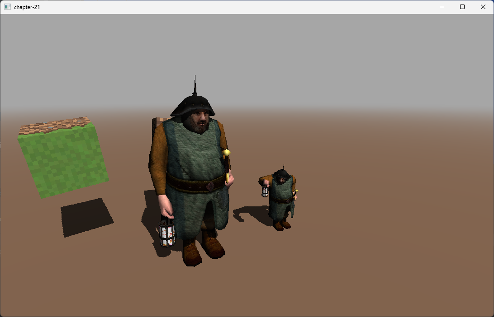

# Chapter 21 - Indirect drawing (animated models) and compute shaders

In this chapter we will add support for animated models when using indirect drawing. In order to do so, we will introduce a new topic, compute shaders. We will use compute shaders to transform model vertices from the binding pose to their final position (according to current animation). Once we have done this, we can use regular shaders to render them, there will be no need to distinguish between animated and non animated models while rendering. In addition to that, we will be able decouple animation transformations from the rendering process. By doing so, we will be able to update animation models in a different rate than the render rate (we do not need to transform animated vertices in each frame if they have not changed).

You can find the complete source code for this chapter [here](https://github.com/lwjglgamedev/lwjglbook/tree/main/chapter-20).

## Concepts

Prior to explaining the code, let's explain the concepts behind indirect drawing for animated models. The approach we will follow will be more or less the same as the one used in the previous chapter. We will have a global buffer which will contain vertices data. The main difference is that we will use first a compute shader to transform vertices from the binding pose to the final one. In addition to that,we will not use multiple instances for a model. The reason for that is.,, even if we have several entities that share the same animated model, they can be in different animation state (the animation may have started after, have a lower update rate or even the specific selected animation of the model may be different). Therefore we will need, inside the global buffer that will contain the animated vertices, a single chunk of data per entity.

We will still need to keep binding data, we will create another global buffer for that for all the meshes of the scene. In this case we do not need to have separate chunks per entity, just one per mesh. The compute shader will access that binding poses data buffer, will process that for each of the entities and will store the results into another global buffer with a structure similar to the one used for static models.

## Model loading

We need to update the `Model` class since we will not store bone matrices data any more in this class. Instead, that information will be stored in a common buffer. Therefore the inner class `AnimatedFrame` cannot be a record any longer (records are immutable).

```java
public class Model {
    ...
    public static class AnimatedFrame {
        private Matrix4f[] bonesMatrices;
        private int offset;

        public AnimatedFrame(Matrix4f[] bonesMatrices) {
            this.bonesMatrices = bonesMatrices;
        }

        public void clearData() {
            bonesMatrices = null;
        }

        public Matrix4f[] getBonesMatrices() {
            return bonesMatrices;
        }

        public int getOffset() {
            return offset;
        }

        public void setOffset(int offset) {
            this.offset = offset;
        }
    }
    ...
}
```

The fact that we pass from a record to a regular inner class, changing the way we access `Model` class attributes requires a slight modification in the `ModelLoader` class:
```java
public class ModelLoader {
    ...
    private static void buildFrameMatrices(AIAnimation aiAnimation, List<Bone> boneList, Model.AnimatedFrame animatedFrame,
                                           int frame, Node node, Matrix4f parentTransformation, Matrix4f globalInverseTransform) {
        ...
        for (Bone bone : affectedBones) {
            ...
            animatedFrame.getBonesMatrices()[bone.boneId()] = boneTransform;
        }
        ...
    }
    ...
}
```

Let's review now the new global buffers that we will need, which will be managed in the `RenderBuffers` class:

```java
public class RenderBuffers {

    private int animVaoId;
    private int bindingPosesBuffer;
    private int bonesIndicesWeightsBuffer;
    private int bonesMatricesBuffer;
    private int destAnimationBuffer;
    ...
    public void cleanup() {
        ...
        glDeleteVertexArrays(animVaoId);
    }
    ...
    public int getAnimVaoId() {
        return animVaoId;
    }

    public int getBindingPosesBuffer() {
        return bindingPosesBuffer;
    }

    public int getBonesIndicesWeightsBuffer() {
        return bonesIndicesWeightsBuffer;
    }

    public int getBonesMatricesBuffer() {
        return bonesMatricesBuffer;
    }

    public int getDestAnimationBuffer() {
        return destAnimationBuffer;
    }
    ...
}
```

The `animVaoId` will store the VAO which will define the data which will contain the transformed animation vertices, that is, the data after it has been processed by the compute shader (remember one chunk per mesh and entity). The data itself will be stored in a buffer, whose handle will be stored in `destAnimationBuffer`. We need to access that buffer in the compute shader which doe snot understand VAOs, just buffers. We will need also to store bone matrices and indices and weights into two buffers represented by `bonesMatricesBuffer` and `bonesIndicesWeightsBuffer` respectively. In the `cleanup` method we must not forget to clean the new VAO. We also need to add getters for the new attributes.

We can now implement the `loadAnimatedModels` which starts like this:
```java
public class RenderBuffers {
    ...
    public void loadAnimatedModels(Scene scene) {
        List<Model> modelList = scene.getModelMap().values().stream().filter(Model::isAnimated).toList();
        loadBindingPoses(modelList);
        loadBonesMatricesBuffer(modelList);
        loadBonesIndicesWeights(modelList);

        animVaoId = glGenVertexArrays();
        glBindVertexArray(animVaoId);
        int positionsSize = 0;
        int normalsSize = 0;
        int textureCoordsSize = 0;
        int indicesSize = 0;
        int offset = 0;
        int chunkBindingPoseOffset = 0;
        int bindingPoseOffset = 0;
        int chunkWeightsOffset = 0;
        int weightsOffset = 0;
        for (Model model : modelList) {
            List<Entity> entities = model.getEntitiesList();
            for (Entity entity : entities) {
                List<RenderBuffers.MeshDrawData> meshDrawDataList = model.getMeshDrawDataList();
                bindingPoseOffset = chunkBindingPoseOffset;
                weightsOffset = chunkWeightsOffset;
                for (MeshData meshData : model.getMeshDataList()) {
                    positionsSize += meshData.getPositions().length;
                    normalsSize += meshData.getNormals().length;
                    textureCoordsSize += meshData.getTextCoords().length;
                    indicesSize += meshData.getIndices().length;

                    int meshSizeInBytes = (meshData.getPositions().length + meshData.getNormals().length * 3 + meshData.getTextCoords().length) * 4;
                    meshDrawDataList.add(new MeshDrawData(meshSizeInBytes, meshData.getMaterialIdx(), offset,
                            meshData.getIndices().length, new AnimMeshDrawData(entity, bindingPoseOffset, weightsOffset)));
                    bindingPoseOffset += meshSizeInBytes / 4;
                    int groupSize = (int) Math.ceil((float) meshSizeInBytes / (14 * 4));
                    weightsOffset += groupSize * 2 * 4;
                    offset = positionsSize / 3;
                }
            }
            chunkBindingPoseOffset += bindingPoseOffset;
            chunkWeightsOffset += weightsOffset;
        }

        destAnimationBuffer = glGenBuffers();
        vboIdList.add(destAnimationBuffer);
        FloatBuffer meshesBuffer = MemoryUtil.memAllocFloat(positionsSize + normalsSize * 3 + textureCoordsSize);
        for (Model model : modelList) {
            model.getEntitiesList().forEach(e -> {
                for (MeshData meshData : model.getMeshDataList()) {
                    populateMeshBuffer(meshesBuffer, meshData);
                }
            });
        }
        meshesBuffer.flip();
        glBindBuffer(GL_ARRAY_BUFFER, destAnimationBuffer);
        glBufferData(GL_ARRAY_BUFFER, meshesBuffer, GL_STATIC_DRAW);
        MemoryUtil.memFree(meshesBuffer);

        defineVertexAttribs();

        // Index VBO
        int vboId = glGenBuffers();
        vboIdList.add(vboId);
        IntBuffer indicesBuffer = MemoryUtil.memAllocInt(indicesSize);
        for (Model model : modelList) {
            model.getEntitiesList().forEach(e -> {
                for (MeshData meshData : model.getMeshDataList()) {
                    indicesBuffer.put(meshData.getIndices());
                }
            });
        }
        indicesBuffer.flip();
        glBindBuffer(GL_ELEMENT_ARRAY_BUFFER, vboId);
        glBufferData(GL_ELEMENT_ARRAY_BUFFER, indicesBuffer, GL_STATIC_DRAW);
        MemoryUtil.memFree(indicesBuffer);

        glBindBuffer(GL_ARRAY_BUFFER, 0);
        glBindVertexArray(0);
    }
    ...
}
```

We will see later on how the following methods are defined but, by now:
* `loadBindingPoses`: Stores binding pose information for all the meshes associated to animated model.
* `loadBonesMatricesBuffer` : Stores the bone matrices for each animation of the animated models.
* `loadBonesIndicesWeights`: Stores the bones indices and weights information of the animated models.

The code is very similar to the `loadStaticModels`, we start by creating a VAO for animated models, and then iterate over the meshes of the models. We will use a single buffer to hold all the data, so we just iterate over those elements to get the final buffer size. Please note that the first loop is a little bit different than the static version. We need to iterate over the entities associated to a model, and for each  of them we calculate the size of all the associated meshes.

Let's examine the `loadBindingPoses` method:

```java
public class RenderBuffers {
    ...
    private void loadBindingPoses(List<Model> modelList) {
        int meshSize = 0;
        for (Model model : modelList) {
            for (MeshData meshData : model.getMeshDataList()) {
                meshSize += meshData.getPositions().length + meshData.getNormals().length * 3 +
                        meshData.getTextCoords().length + meshData.getIndices().length;
            }
        }

        bindingPosesBuffer = glGenBuffers();
        vboIdList.add(bindingPosesBuffer);
        FloatBuffer meshesBuffer = MemoryUtil.memAllocFloat(meshSize);
        for (Model model : modelList) {
            for (MeshData meshData : model.getMeshDataList()) {
                populateMeshBuffer(meshesBuffer, meshData);
            }
        }
        meshesBuffer.flip();
        glBindBuffer(GL_SHADER_STORAGE_BUFFER, bindingPosesBuffer);
        glBufferData(GL_SHADER_STORAGE_BUFFER, meshesBuffer, GL_STATIC_DRAW);
        MemoryUtil.memFree(meshesBuffer);

        glBindBuffer(GL_ARRAY_BUFFER, 0);
    }
    ...
}
```

The `loadBindingPoses` iterates over all the animated models, getting the total size to accommodate all the associated meshes. With that size, a buffer is created and populated using the `populateMeshBuffer` which was already present in the chapter before. Therefore, we store binding pose vertices for all the meshes of the animated models into a single buffer. We will access this buffer in the compute shader, so you can see that we use the `GL_SHADER_STORAGE_BUFFER` flag when binding. 

The `loadBonesMatricesBuffer` method is defined like this:

```java
public class RenderBuffers {
    ...
    private void loadBonesMatricesBuffer(List<Model> modelList) {
        int bufferSize = 0;
        for (Model model : modelList) {
            List<Model.Animation> animationsList = model.getAnimationList();
            for (Model.Animation animation : animationsList) {
                List<Model.AnimatedFrame> frameList = animation.frames();
                for (Model.AnimatedFrame frame : frameList) {
                    Matrix4f[] matrices = frame.getBonesMatrices();
                    bufferSize += matrices.length * 64;
                }
            }
        }

        bonesMatricesBuffer = glGenBuffers();
        vboIdList.add(bonesMatricesBuffer);
        ByteBuffer dataBuffer = MemoryUtil.memAlloc(bufferSize);
        int matrixSize = 4 * 4 * 4;
        for (Model model : modelList) {
            List<Model.Animation> animationsList = model.getAnimationList();
            for (Model.Animation animation : animationsList) {
                List<Model.AnimatedFrame> frameList = animation.frames();
                for (Model.AnimatedFrame frame : frameList) {
                    frame.setOffset(dataBuffer.position() / matrixSize);
                    Matrix4f[] matrices = frame.getBonesMatrices();
                    for (Matrix4f matrix : matrices) {
                        matrix.get(dataBuffer);
                        dataBuffer.position(dataBuffer.position() + matrixSize);
                    }
                    frame.clearData();
                }
            }
        }
        dataBuffer.flip();

        glBindBuffer(GL_SHADER_STORAGE_BUFFER, bonesMatricesBuffer);
        glBufferData(GL_SHADER_STORAGE_BUFFER, dataBuffer, GL_STATIC_DRAW);
        MemoryUtil.memFree(dataBuffer);
    }
    ...
}
```

We start iterating over the animation data for each of the models, getting the associated transformation matrices (for all the bones) for each of the animated frames in order to calculate the buffer that will hold all that information. Once we have the size, we create the buffer and start populating that (in the second loop) with those matrices. As in the previous buffer we will access this buffer in the compute shader, therefore we need to use the `GL_SHADER_STORAGE_BUFFER` flag.

The `loadBonesIndicesWeights` method is defined like this:

```java
public class RenderBuffers {
    ...
    private void loadBonesIndicesWeights(List<Model> modelList) {
        int bufferSize = 0;
        for (Model model : modelList) {
            for (MeshData meshData : model.getMeshDataList()) {
                bufferSize += meshData.getBoneIndices().length * 4 + meshData.getWeights().length * 4;
            }
        }
        ByteBuffer dataBuffer = MemoryUtil.memAlloc(bufferSize);
        for (Model model : modelList) {
            for (MeshData meshData : model.getMeshDataList()) {
                int[] bonesIndices = meshData.getBoneIndices();
                float[] weights = meshData.getWeights();
                int rows = bonesIndices.length / 4;
                for (int row = 0; row < rows; row++) {
                    int startPos = row * 4;
                    dataBuffer.putFloat(weights[startPos]);
                    dataBuffer.putFloat(weights[startPos + 1]);
                    dataBuffer.putFloat(weights[startPos + 2]);
                    dataBuffer.putFloat(weights[startPos + 3]);
                    dataBuffer.putFloat(bonesIndices[startPos]);
                    dataBuffer.putFloat(bonesIndices[startPos + 1]);
                    dataBuffer.putFloat(bonesIndices[startPos + 2]);
                    dataBuffer.putFloat(bonesIndices[startPos + 3]);
                }
            }
        }
        dataBuffer.flip();

        bonesIndicesWeightsBuffer = glGenBuffers();
        vboIdList.add(bonesIndicesWeightsBuffer);
        glBindBuffer(GL_SHADER_STORAGE_BUFFER, bonesIndicesWeightsBuffer);
        glBufferData(GL_SHADER_STORAGE_BUFFER, dataBuffer, GL_STATIC_DRAW);
        MemoryUtil.memFree(dataBuffer);

        glBindBuffer(GL_SHADER_STORAGE_BUFFER, 0);
    }
    ...
}
```

As in the previous methods, we will store the weights and bone indices information into a single buffer, so we need to first calculate its size and later on populate it. As in the previous buffer we will access this buffers in the compute shader, therefore we need to use the `GL_SHADER_STORAGE_BUFFER` flag.

## Compute shaders

TBD: AnimationRender

## Other changes

TODO:
- SceneRender
- ShadowRender
- Main

In the `Render` class we just need to instantiate the `AnimationRender` class, and use it in the `render` loop and the `cleanup` method. In the `render` loop we will invoke the `AnimationRender` class `render` method at the very beginning, so animation transformations are applied prior to render the scene.

```java
public class Render {

    private AnimationRender animationRender;
    ...
    public Render(Window window) {
        ...
        animationRender = new AnimationRender();
        ...
    }

    public void cleanup() {
        ...
        animationRender.cleanup();
        ...
    }

    public void render(Window window, Scene scene) {
        animationRender.render(scene, renderBuffers);
        ...
    }    
    ...
}
```

Finally, in the `Main` class we will create two animated entities which will have a different animation update rate to check that we correctly separate per entity information:

```java
public class Main implements IAppLogic {
    ...
    private AnimationData animationData1;
    private AnimationData animationData2;
    ...
    public static void main(String[] args) {
        ...
        Engine gameEng = new Engine("chapter-21", opts, main);
        ...
    }
    ...
    public void init(Window window, Scene scene, Render render) {
        ...
        String bobModelId = "bobModel";
        Model bobModel = ModelLoader.loadModel(bobModelId, "resources/models/bob/boblamp.md5mesh",
                scene.getTextureCache(), scene.getMaterialCache(), true);
        scene.addModel(bobModel);
        Entity bobEntity = new Entity("bobEntity-1", bobModelId);
        bobEntity.setScale(0.05f);
        bobEntity.updateModelMatrix();
        animationData1 = new AnimationData(bobModel.getAnimationList().get(0));
        bobEntity.setAnimationData(animationData1);
        scene.addEntity(bobEntity);

        Entity bobEntity2 = new Entity("bobEntity-2", bobModelId);
        bobEntity2.setPosition(2, 0, 0);
        bobEntity2.setScale(0.025f);
        bobEntity2.updateModelMatrix();
        animationData2 = new AnimationData(bobModel.getAnimationList().get(0));
        bobEntity2.setAnimationData(animationData2);
        scene.addEntity(bobEntity2);
        ...
    }
    ...
    public void update(Window window, Scene scene, long diffTimeMillis) {
        animationData1.nextFrame();
        if (diffTimeMillis % 2 == 0) {
            animationData2.nextFrame();
        }
        ...
    }
}
```

With all of that changes implemented you should be able to see something similar to this.

